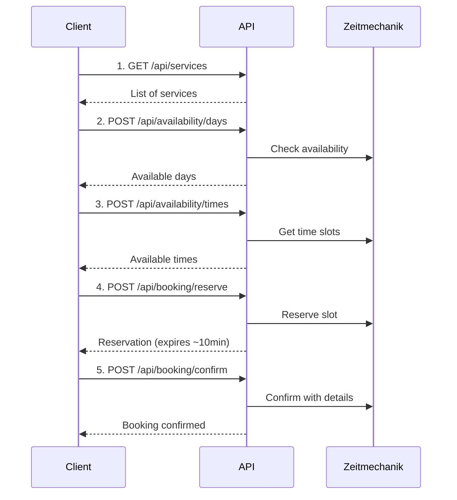

# Brunkhorst Connector

The Brunkhorst Connector provides a REST API for the Zeitmechanik workshop booking system used by Autohaus Brunkhorst.

## Features

- **Service Catalog**: Browse available workshop services (inspections, maintenance, repairs)
- **Availability Check**: Find available days and time slots for selected services
- **Appointment Booking**: Two-step reservation and confirmation flow
- **Customer Lookup**: Search existing customers by phone, name, or license plate

## Base URL

<CodeGroup>
```bash Production
https://brunkhorst.connectors.aicoflow.com
```

```bash Development
http://localhost:8101
```

</CodeGroup>

## Booking Flow

The appointment booking process follows a two-step flow to prevent conflicts:



<Warning>
	Reservations expire after approximately 10 minutes. Make sure to confirm
	quickly!
</Warning>

## API Reference

See the **Brunkhorst API** tab above for the full interactive API reference with all endpoints:

- **Services**: List and get details for available workshop services
- **Availability**: Check available days and time slots
- **Booking**: Reserve and confirm appointments
- **Lookup**: Search customers by phone, name, or license plate

## Notes

- **14-day buffer**: Available days are filtered to be at least 14 days in the future to ensure adequate preparation time
- **German localization**: Day and month names are returned in German
- **Session storage**: The API stores reservation IDs server-side, linked by `session_id` for multi-step flows
