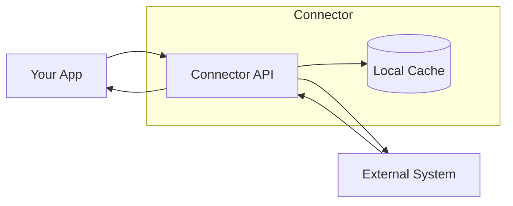

# AICO Connectors

AICO Connectors provide REST APIs for integrating with external workshop management and booking systems. Each connector is a standalone microservice that handles authentication, data synchronization, and business operations for its target system.

## Available Connectors

<CardGroup cols={2}>
  <Card title="Brunkhorst Connector" icon="calendar" href="/connectors/brunkhorst/overview">
    Zeitmechanik workshop booking integration for Autohaus Brunkhorst. Schedule appointments, check availability, and manage customer data.
  </Card>
  <Card title="PlanSo Connector" icon="car" href="/connectors/reit/overview">
    PlanSo order management integration. Sync repair orders, track parts, and manage workshop operations.
  </Card>
</CardGroup>

## Architecture Overview

Each connector follows a consistent architecture:

- **FastAPI Backend**: Async Python API with automatic OpenAPI documentation
- **Local Caching**: SQLite or in-memory storage for fast queries
- **Background Sync**: Automatic data synchronization with source systems
- **Structured Logging**: JSON-formatted logs with correlation IDs for traceability

## Quick Links

- [Brunkhorst API Reference](/connectors/brunkhorst/overview)
- [PlanSo API Reference](/connectors/reit/overview)
- [Quickstart Guide](/connectors/quickstart)
