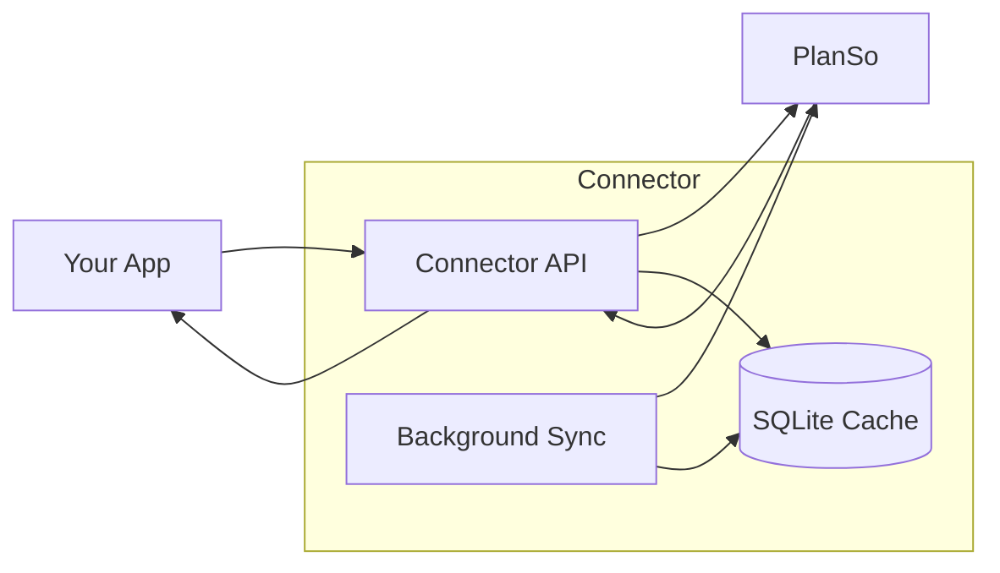

# PlanSo Connector

The PlanSo Connector (codename: "reit") provides a REST API for the PlanSo workshop management system, enabling order synchronization and queries.

## Features

- **Order Sync**: Automatic background synchronization from PlanSo to local SQLite database
- **Rich Queries**: Search orders by plate, person, phone, email, status, damage type, and date ranges
- **Parts Tracking**: View parts lists with order/delivery status
- **CRUD Operations**: Create, update, and delete orders in PlanSo

## Base URL

<CodeGroup>
```bash Production
https://reit.connectors.aicoflow.com
```

```bash Development
http://localhost:8102
```

</CodeGroup>

## Architecture

The connector maintains a local SQLite database that mirrors PlanSo data for fast queries:



### Sync Behavior

- **Background Sync**: Runs automatically during business hours (7:00-19:00 Berlin time by default)
- **Manual Sync**: Trigger anytime via the sync endpoint
- **Configurable**: Parts sync, extended data sync, and sync intervals are all configurable

<Info>
	Queries hit the local SQLite database, making them fast even for large
	datasets. Data freshness depends on sync frequency.
</Info>

## API Reference

See the **PlanSo API** tab above for the full interactive API reference with all endpoints:

- **Authentication**: Login to PlanSo
- **Sync**: Trigger manual sync and check status
- **Orders**: Query, create, update, and delete orders
- **Parts**: View parts list and delivery status for orders

## Data Model

### Order

An order represents a repair project with:

| Field                                     | Description                   |
| ----------------------------------------- | ----------------------------- |
| `id`                                      | Unique order ID               |
| `plate`                                   | Vehicle license plate         |
| `person`                                  | Customer/driver name          |
| `phone`, `email`                          | Contact information           |
| `damage`                                  | Damage classification         |
| `project_status`                          | Current status                |
| `shop_date`, `repair_date`, `finish_date` | Key dates                     |
| `parts_status`, `missing_parts`           | Parts tracking                |
| `est_hours_*`                             | Estimated hours by department |

### Part

Parts are linked to orders:

| Field                                      | Description          |
| ------------------------------------------ | -------------------- |
| `order_id`                                 | Parent order         |
| `part_no`, `description`                   | Part identification  |
| `qty`, `price_each`, `price_total`         | Quantity and pricing |
| `status`, `status_code`                    | Current status       |
| `order_date`, `delivery_date`, `eta_date`  | Tracking dates       |
| `is_missing`, `is_ordered`, `is_delivered` | Status flags         |

## Configuration

The connector behavior is controlled by environment variables:

| Variable                      | Default | Description                     |
| ----------------------------- | ------- | ------------------------------- |
| `AUTO_SYNC_ENABLED`           | `true`  | Enable background sync          |
| `SYNC_INTERVAL_SECONDS`       | `3600`  | Sync interval (1 hour)          |
| `SYNC_WITH_PARTS`             | `true`  | Sync parts data                 |
| `SYNC_WITH_EXTENDED_DATA`     | `false` | Sync extended sections          |
| `SYNC_BUSINESS_HOURS_ENABLED` | `true`  | Only sync during business hours |
