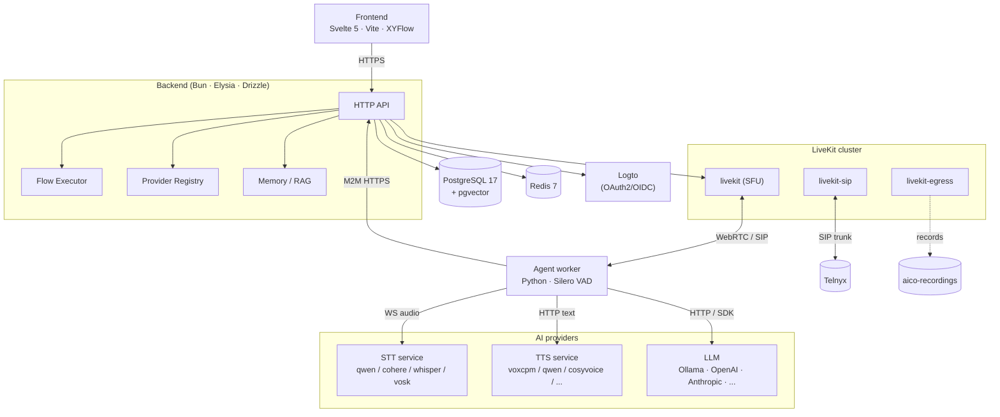
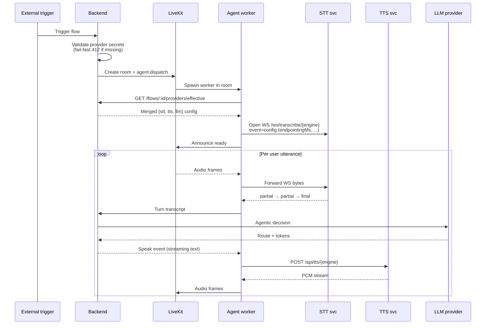
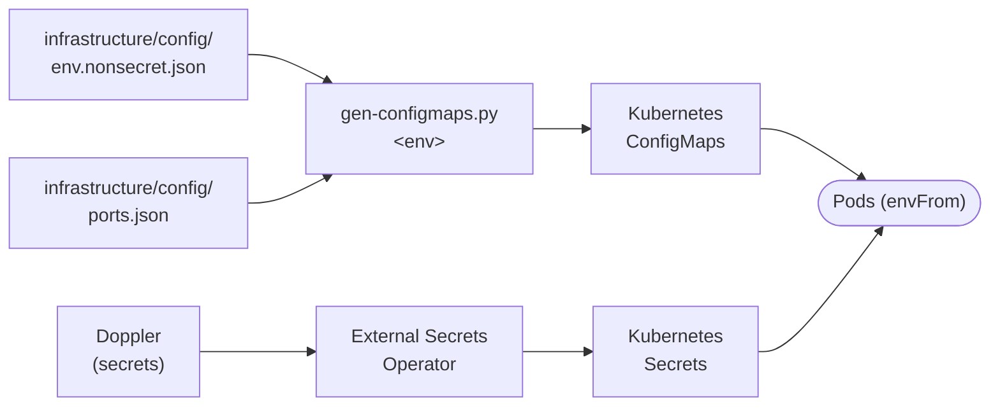

## Runtime topology

Containers that ship in the dev compose: `postgres`, `redis`, `livekit`,
`livekit-sip`, `livekit-egress`, `ollama`, `stt`, `tts`, `agent`,
`backend`, `frontend`. The ROCm overlay swaps `stt`, `tts`, `ollama` to
ROCm variants pinned with `HSA_OVERRIDE_GFX_VERSION=11.0.0` for RDNA3.

## Session lifecycle

From a trigger (phone call, WhatsApp, HTTP) to an active conversation:

## Components

### Frontend

Svelte 5 SPA. Talks to the backend only — never directly to providers,
STT, TTS, or LiveKit. Authentication via Logto's browser SDK. The flow
builder uses XYFlow for graph rendering.

### Backend

Single Bun process, single PostgreSQL instance. Surface for every
domain: flow CRUD, execution orchestration, provider definitions,
organization secrets, telephony, channels, memory, knowledge, reporting.
Route policies are enforced at request ingress
(`backend/src/routes/middleware/policies.ts`); missing entries crash
startup.

### Agent worker

One Python process per concurrent voice session, spawned by LiveKit on
agent dispatch. Holds no persistent state — fetches everything from the
backend at session start.

- Audio I/O via LiveKit WebRTC / SIP
- Silero VAD → start/end-of-speech, barge-in
- Turn detector (multilingual) → when to commit transcripts to the LLM
- Streams transcripts and tool results over M2M HTTPS

### STT service (FastAPI)

| Endpoint | Purpose |
|---|---|
| `POST /api/stt/{engine}` | File transcription, specific engine |
| `WS /ws/transcribe/{engine}` | Streaming transcription |
| `GET /providers/schema` | Runtime + request schemas |
| `POST /providers/{name}/enable\|disable\|config` | Operator runtime controls |
| `GET /gpu` | VRAM per device |

Engines: Qwen3-ASR, Cohere Transcribe, faster-whisper, Vosk.

### TTS service (FastAPI)

Same shape. Adds:

| Endpoint | Purpose |
|---|---|
| `GET /voices`, `POST /voices`, `DELETE /voices/{id}` | Shared voice-clone store |

Engines: VoxCPM2, Qwen3-TTS, CosyVoice2, F5-TTS, Orpheus, Kokoro, Piper.

### LiveKit

Three containers: `livekit` (SFU), `livekit-sip` (SIP ↔ WebRTC), and
`livekit-egress` (recording). Rooms are provisioned on demand by the
backend using the LiveKit server SDK.

### Databases

- **PostgreSQL 17 + pgvector** — every domain entity plus embedding
  vectors for RAG and episodic memory.
- **Redis** — provider-config cache (5 min TTL), live monitoring
  state, rate limiting.

## Inter-service communication

| From → To | Protocol | Auth |
|---|---|---|
| Frontend → Backend | HTTPS (Eden Treaty) | Logto user token |
| Agent worker → Backend | HTTPS REST | Logto M2M (client_credentials) |
| Backend → LiveKit | LiveKit SDK | API key / secret |
| Agent worker ↔ LiveKit | WebRTC | Room-scoped JWT from backend |
| Agent worker → STT / TTS | WebSocket / HTTP | **none (internal network)** |
| Backend → Logto | HTTPS admin API | M2M token |
| Backend → Nango | HTTPS | `NANGO_SECRET_KEY` |
| Backend → Telnyx | HTTPS | per-org API key from DB |

<Warning>
	STT and TTS services currently run without authentication. They are
	only reachable on the internal Docker network. Running them across an
	untrusted network requires adding an auth layer.
</Warning>

## Configuration pipeline

Environments: `lab` (local k3s), `hetzner-prod`, `fly`. Source of truth for
non-secret config is `infrastructure/config/*.json`; secrets live in Doppler
and are synced into Kubernetes Secrets by ESO. **Never duplicate keys
between the two** — Doppler wins at runtime if a conflict occurs.

## Hot reload in development

| Service | Mechanism |
|---|---|
| `backend` | Bun `--watch` |
| `frontend` | Vite HMR |
| `agent` | `watchmedo auto-restart` on `.py` |
| `stt`, `tts` | `uvicorn --reload` gated by `STT_DEV_RELOAD=1` / `TTS_DEV_RELOAD=1` |

No service needs a manual restart for code changes in dev.
