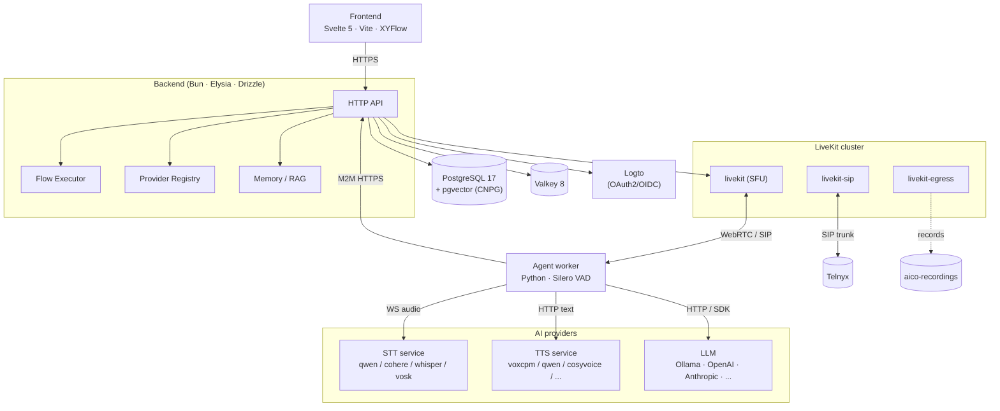
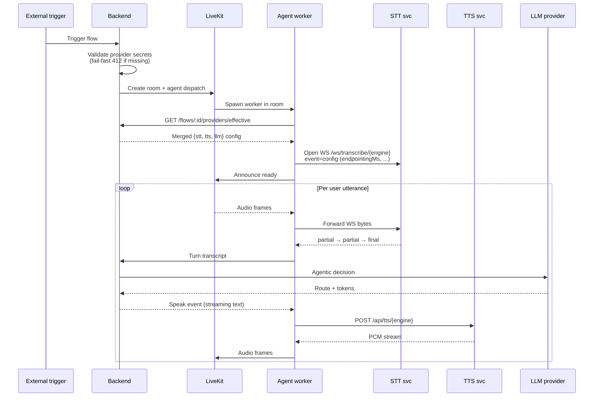
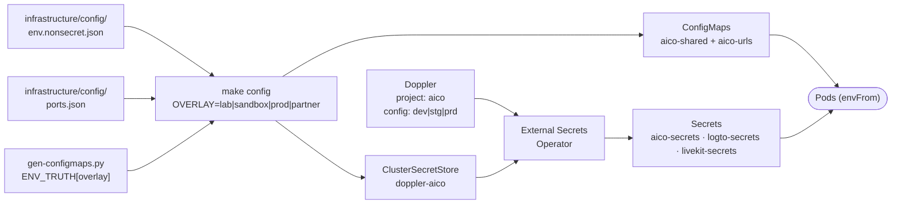

## Runtime topology

Deployed as k8s workloads across `aico` (app tier), `aico-data` (CNPG
Postgres + Valkey), `aico-media` (LiveKit cluster + STUNner), and
`aico-auth` (Logto). ROCm-variant STT/TTS pods are node-selected onto
workers that expose `/dev/kfd` with `HSA_OVERRIDE_GFX_VERSION=11.0.0`
for RDNA3; other nodes run the CPU fallback images.

## Session lifecycle

From a trigger (phone call, WhatsApp, HTTP) to an active conversation:

## Components

### Frontend

Svelte 5 SPA. Talks to the backend only — never directly to providers,
STT, TTS, or LiveKit. Authentication via Logto's browser SDK. The flow
builder uses XYFlow for graph rendering.

### Backend

Single Bun process, single PostgreSQL instance. Surface for every
domain: flow CRUD, execution orchestration, provider definitions,
organization secrets, telephony, channels, memory, knowledge, reporting.
Route policies are enforced at request ingress
(`backend/src/routes/middleware/policies.ts`); missing entries crash
startup.

### Agent worker

One Python process per concurrent voice session, spawned by LiveKit on
agent dispatch. Holds no persistent state — fetches everything from the
backend at session start.

- Audio I/O via LiveKit WebRTC / SIP
- Silero VAD → start/end-of-speech, barge-in
- Turn detector (multilingual) → when to commit transcripts to the LLM
- Streams transcripts and tool results over M2M HTTPS

### STT service (FastAPI)

| Endpoint | Purpose |
|---|---|
| `POST /api/stt/{engine}` | File transcription, specific engine |
| `WS /ws/transcribe/{engine}` | Streaming transcription |
| `GET /providers/schema` | Runtime + request schemas |
| `POST /providers/{name}/enable\|disable\|config` | Operator runtime controls |
| `GET /gpu` | VRAM per device |

Engines: Qwen3-ASR, Cohere Transcribe, faster-whisper, Vosk.

### TTS service (FastAPI)

Same shape. Adds:

| Endpoint | Purpose |
|---|---|
| `GET /voices`, `POST /voices`, `DELETE /voices/{id}` | Shared voice-clone store |

Engines: VoxCPM2, Qwen3-TTS, CosyVoice2, F5-TTS, Orpheus, Kokoro, Piper.

### LiveKit

Three containers: `livekit` (SFU), `livekit-sip` (SIP ↔ WebRTC), and
`livekit-egress` (recording). Rooms are provisioned on demand by the
backend using the LiveKit server SDK.

### Databases

- **PostgreSQL 17 + pgvector** — managed by CloudNativePG; every domain
  entity plus embedding vectors for RAG and episodic memory. A separate
  CNPG cluster (`logto-db` in `aico-auth`) holds Logto's own schema.
- **Valkey 8** — provider-config cache (5 min TTL), live monitoring
  state, rate limiting. API-compatible Redis replacement.

## Inter-service communication

| From → To | Protocol | Auth |
|---|---|---|
| Frontend → Backend | HTTPS (Eden Treaty) | Logto user token |
| Agent worker → Backend | HTTPS REST | Logto M2M (client_credentials) |
| Backend → LiveKit | LiveKit SDK | API key / secret |
| Agent worker ↔ LiveKit | WebRTC | Room-scoped JWT from backend |
| Agent worker → STT / TTS | WebSocket / HTTP | **none (internal network)** |
| Backend → Logto | HTTPS admin API | M2M token |
| Backend → Nango | HTTPS | `NANGO_SECRET_KEY` |
| Backend → Telnyx | HTTPS | per-org API key from DB |

<Warning>
	STT and TTS services currently run without authentication. Inside
	the cluster they're only reachable via ClusterIP (no Gateway route),
	and CiliumNetworkPolicy restricts ingress to the `aico` namespace.
	Exposing them across an untrusted network requires adding an auth
	layer.
</Warning>

## Configuration pipeline

Overlays: `lab` (local k3s), `sandbox` (aicoflow.xyz), `hetzner-prod`
(aicoyo.com), `partner` (on-prem template). Source of truth for
per-overlay distinction is the `ENV_TRUTH` table in
`gen-configmaps.py`; per-install SMTP/landing URLs live in
`env.nonsecret.json`. Secrets live in Doppler (or a partner's equivalent)
and reach pods as k8s Secrets via ESO. **Never duplicate keys between
ConfigMap and Doppler** — Doppler wins at runtime via envFrom ordering.

## Hot reload in development

Under `make dev` (Tilt):

| Service | Mechanism |
|---|---|
| `backend` | Bun `--watch` re-executes on every src/seeds edit |
| `frontend` | Vite HMR over WebSocket |
| `agent-worker` | `docker_build_with_restart` sends SIGTERM on sync; Tilt relaunches |
| `stt`, `tts`, `logto` | Not live-reloaded — edit via `make <svc>-build` then `make <svc>-restart` |

Tilt owns backend/frontend/agent during `make dev`; Argo CD will try to
revert the hot-reload image tags, so pause sync for those three
Deployments before starting. `mirrord` provides a secondary path — run
the service LOCALLY with the pod's network + env (see
`.mirrord/*.json`).
