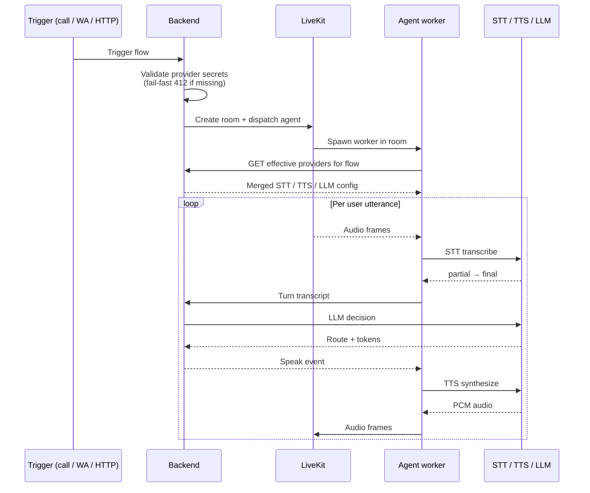
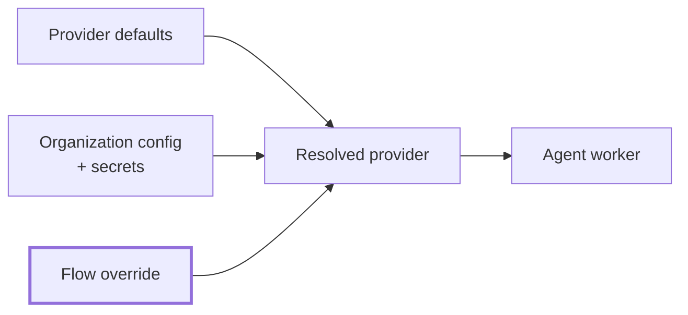

AICO is a voice-agent runtime. A trigger (phone call, WhatsApp message,
HTTP request) starts a session; a flow runs to completion, calling
swappable speech and language providers as it goes.

## The pieces

| Component | What it does |
|---|---|
| **Backend** | REST + WebSocket API. Runs the flow executor, resolves providers, persists every session. The single domain surface every other component talks to. |
| **Frontend** | Dashboard — flow builder, monitoring, organization + provider management. Talks only to the backend. |
| **Agent worker** | One short-lived process per active voice session. Streams audio between the caller, the STT service, the LLM, and the TTS service. |
| **STT, TTS, LLM providers** | Pluggable. Cloud (Deepgram, ElevenLabs, OpenAI, …) or self-hosted (Whisper, Vosk, Piper, Kokoro, Ollama, vLLM). Selected per flow. |
| **PostgreSQL + pgvector** | Source of truth for flows, sessions, organizations, secrets, embeddings, transcripts. |
| **Logto** | OIDC identity provider for users + machine-to-machine tokens. |
| **LiveKit** | WebRTC + SIP transport for voice. |

## Session lifecycle

From a trigger to an active conversation:

The flow executor is **stateless per request** — every invocation
reconstructs state from PostgreSQL. A long conversation runs as many
short executor calls, driven by inbound events (transcripts, tool
callbacks, child-flow completions).

## Provider resolution

Three layers merge into a single resolved config per session:

Priority: **flow > organization > default**. Missing required secrets
fail the trigger with HTTP 412 before the agent worker is dispatched
— preventing opaque mid-call SDK errors.

## Channels

| Channel | Transport | Status |
|---|---|---|
| Phone | SIP via LiveKit SIP + telephony provider (Telnyx / Twilio) | implemented |
| WhatsApp | Meta Cloud API | implemented |
| Web widget | — | not implemented |

Channel-specific prompt hints are injected into the LLM context so a
voice flow gets SSML / inline-tag guidance and a chat flow gets
markdown guidance — same flow definition, different rendering hint.

## Memory

Three layers, all backed by pgvector:

- **Episodic memory** — long-term semantic chunks of user turns.
  Searchable by user / cluster.
- **Persistent user facts** — extracted after each turn (`role`,
  `type`, `value`). Newer extractions supersede older ones.
- **Knowledge bases** — per-org document collections, retrievable
  through the `rag` flow node.
