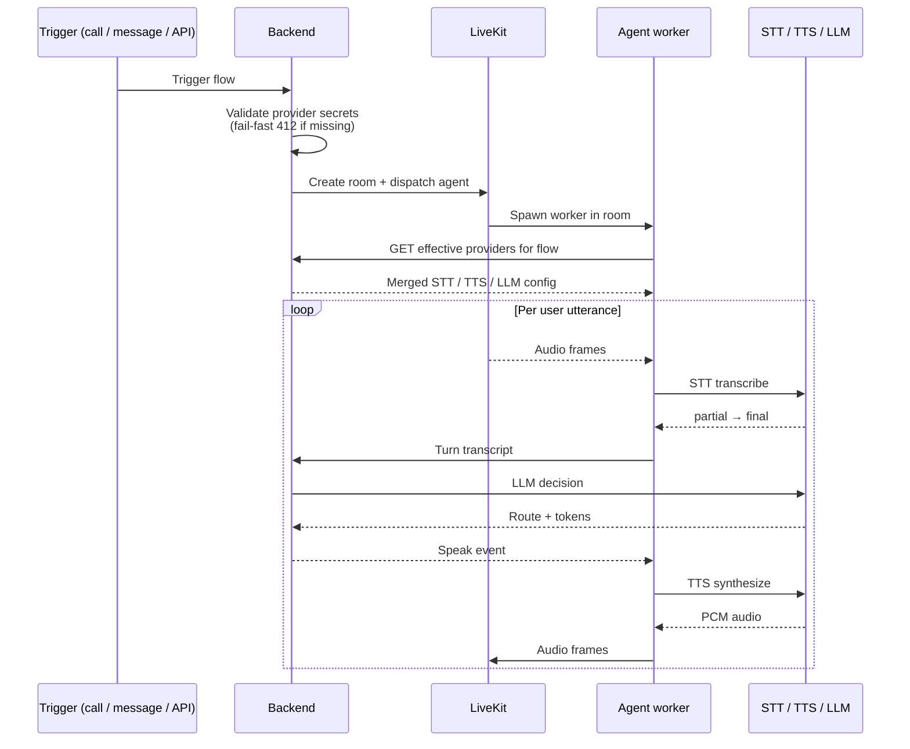
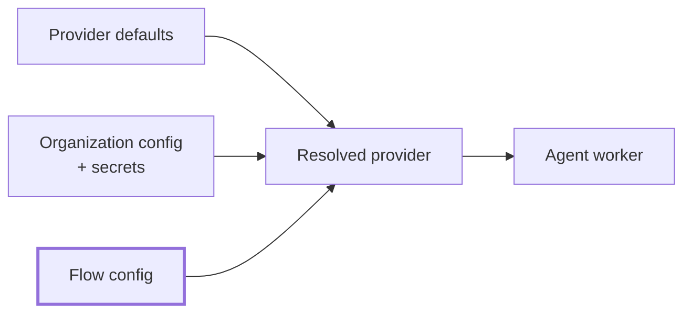

AICO is a voice- and chat-agent runtime. A trigger (phone call,
WhatsApp or SMS message, widget visitor, API request) starts a
session; a flow runs to completion, calling swappable speech and
language providers as it goes.

## The pieces

| Component | What it does |
|---|---|
| **Backend** | REST + streaming API. Runs the flow executor, resolves providers, persists every session. The single domain surface every other component talks to. |
| **Frontend** | Dashboard — flow builder, monitoring, organization + provider management. Talks only to the backend. |
| **Agent worker** | One short-lived process per active voice session. Streams audio between the caller, the STT service, the LLM, and the TTS service. |
| **STT, TTS, LLM providers** | Pluggable. Cloud (Deepgram, ElevenLabs, OpenAI, Anthropic, …) or self-hosted (Whisper, Qwen, Piper, CosyVoice, vLLM, Ollama). Selected per flow. |
| **Channel adapters** | Plugin per channel (voice, web, WhatsApp, SMS, …) that normalises inbound webhooks and outbound delivery. |
| **PostgreSQL + pgvector** | Source of truth for flows, sessions, organizations, secrets, embeddings, transcripts. |
| **Logto** | OIDC identity provider for users + machine-to-machine tokens. |
| **LiveKit** | WebRTC + SIP transport for voice. |

## Session lifecycle

From a trigger to an active voice conversation:

```mermaid
sequenceDiagram
    participant Ext as Trigger (call / message / API)
    participant BE as Backend
    participant LK as LiveKit
    participant AGT as Agent worker
    participant Prov as STT / TTS / LLM

    Ext->>BE: Trigger flow
    BE->>BE: Validate provider secrets<br/>(fail-fast 412 if missing)
    BE->>LK: Create room + dispatch agent
    LK->>AGT: Spawn worker in room
    AGT->>BE: GET effective providers for flow
    BE-->>AGT: Merged STT / TTS / LLM config
    loop Per user utterance
        LK-->>AGT: Audio frames
        AGT->>Prov: STT transcribe
        Prov-->>AGT: partial → final
        AGT->>BE: Turn transcript
        BE->>Prov: LLM decision
        Prov-->>BE: Route + tokens
        BE-->>AGT: Speak event
        AGT->>Prov: TTS synthesize
        Prov-->>AGT: PCM audio
        AGT->>LK: Audio frames
    end
```

Text channels (WhatsApp, SMS, widget chat) skip the media path: the
inbound message is handed to the flow executor directly and the reply
is delivered through the channel adapter. The flow definition is the
same either way.

The flow executor is **stateless per request** — every invocation
reconstructs state from PostgreSQL. A long conversation runs as many
short executor calls, driven by inbound events (transcripts, tool
callbacks, child-flow completions).

## Provider resolution

Each flow **selects** its STT, TTS, and LLM providers. Configuration
for the selected provider merges three layers:

```mermaid
flowchart LR
    D["Provider defaults"] --> M
    O["Organization config<br/>+ secrets"] --> M
    F["Flow config"] --> M
    M["Resolved provider"] --> AGT["Agent worker"]
    style F stroke-width:3px
```

Config precedence: **flow > organization > provider defaults**. The
organization supplies credentials (API keys) and shared defaults; the
flow picks the provider and overrides tuning per use case. Missing
required secrets fail the trigger with HTTP 412 before the agent
worker is dispatched — preventing opaque mid-call SDK errors.

## Channels

Conversations run over eight channel types — phone (SIP), web widget
(text + voice), WhatsApp, SMS, API, store-and-forward audio clips,
child-flow sessions, and Telegram (planned). Each channel declares its
capabilities (addressability, persistence, outbound initiation) and
its reachability window. Full detail: [Channels](/platform/channels).

Channel-specific prompt hints are injected into the LLM context so a
voice flow gets speech-rendering guidance and a chat flow gets
markdown guidance — same flow definition, different rendering hint.

## Memory

Three layers, all backed by pgvector:

- **Episodic memory** — long-term semantic chunks of user turns,
  facts, preferences, and observations. Extracted automatically at
  session end. Searchable by user.
- **Persistent variables** — flow variables marked as persistent
  survive across sessions for the same user.
- **Knowledge bases** — per-organization document collections,
  retrievable through the `rag` flow node.

Identity is unified across channels: a caller's phone number and a
messaging identity on the same number converge on one memory profile,
and an anonymous web visitor's memory is merged into their verified
identity once they are identified.
