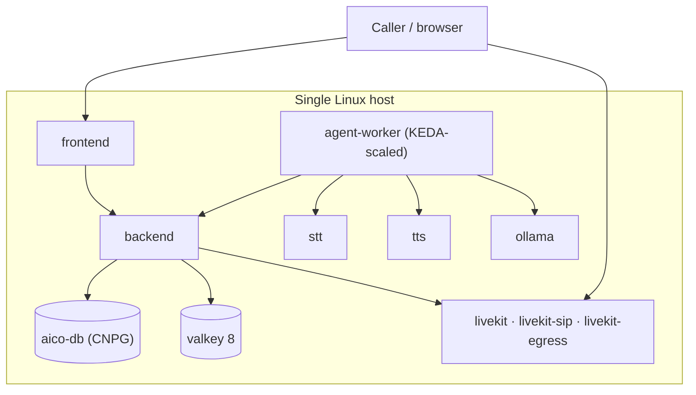
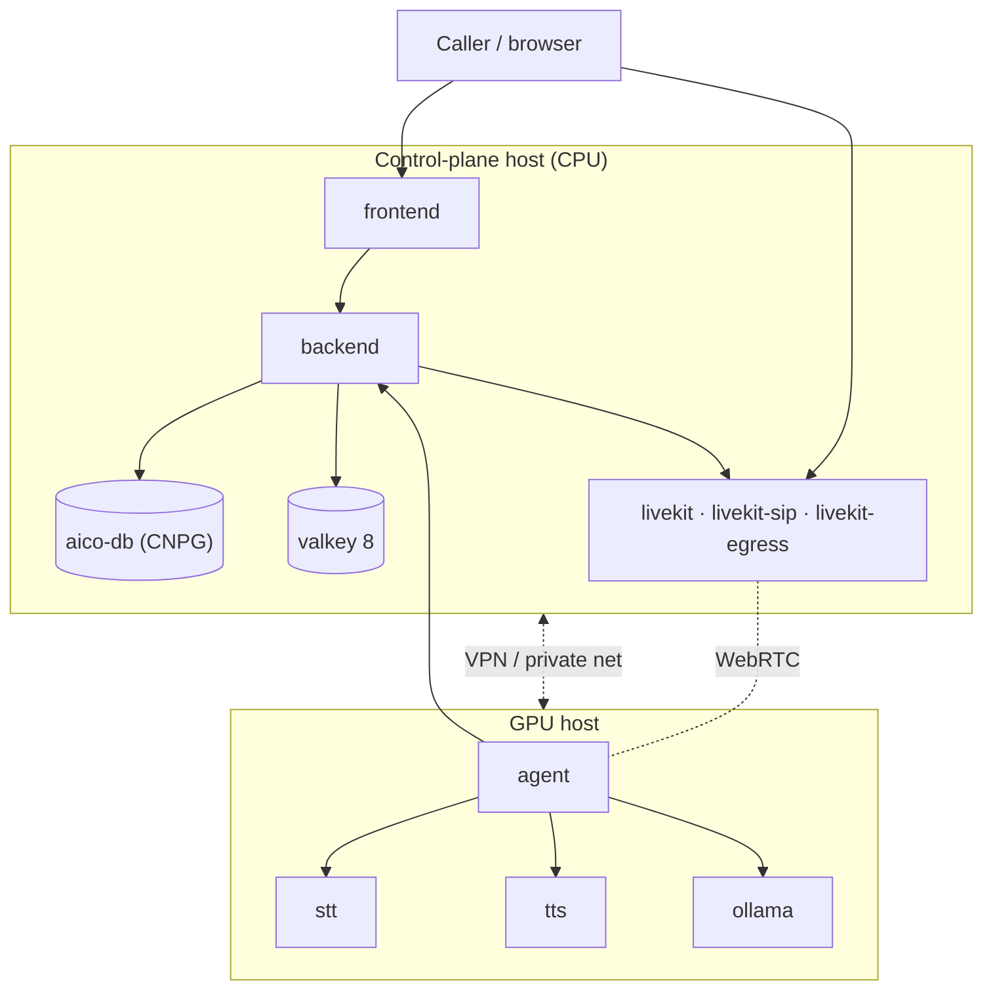

## Topology options

### Single host (dev / small prod)

Everything in one Kubernetes cluster (lab or cloud). The `make lab-up`
entrypoint provisions 6 Incus VMs as a HA k3s cluster and applies the full
stack via Argo CD + Kustomize. See `SCALE.md` and `FINETUNE.md` in the repo
root for the multi-target roadmap (lab → Hetzner → Fly.io).

GPU acceleration for STT/TTS (Orpheus, CosyVoice, Qwen) requires AMD ROCm
or NVIDIA CUDA on a dedicated worker node — not yet wired in the lab (see
FINETUNE.md Sprint 5).

### Split (GPU + control plane)

<Warning>
	`stt` and `tts` services currently run without authentication. If
	placing them on a separate host, secure the link (VPN, WireGuard,
	Tailscale, or mTLS proxy) — otherwise the inference endpoints are
	reachable by anything that can route to them.
</Warning>

### Deployment overlays

| Overlay | Branch → Doppler | Seed strategy | Cluster |
|---|---|---|---|
| `lab` | `dev` → `dev` | `demo` profile, `fresh` (truncate + reseed) | local Incus k3s |
| `sandbox` | `sandbox` → `stg` | `demo` profile, `upsert` | aicoflow.xyz |
| `prod` (hetzner-prod) | `main` → `prd` | `default` profile, `once` | aicoyo.com |
| `partner` | partner-owned | `default` profile, `once` | on-prem (forked repo) |

Argo CD continuously syncs `deploy/k8s/overlays/<overlay>` from git. CI
pushes images to GHCR (or the partner's registry); the next Argo sync
rolls them. The single source of truth that distinguishes overlays is
the `ENV_TRUTH` table in `infrastructure/lab/gen-configmaps.py` — every
downstream env knob (NODE_ENV, SEED_PROFILE/STRATEGY, LOGTO_ENVIRONMENT,
DOPPLER_CONFIG) is derived from the overlay name.

## Hardware sizing

Target: **10 concurrent voice sessions, 8K LLM context**. STT + TTS
model weights are shared across sessions; **LLM KV cache is per-session
and dominates VRAM**.

### LLM VRAM (Q4_K_M quantization)

| Model | Weights | KV @ 8K × 10 | Total VRAM |
|---|---|---|---|
| Gemma 3 4B | 2.5 GB | 8 GB | **~11 GB** |
| Gemma 3 12B | 7 GB | 20 GB | **~29 GB** |
| Gemma 3 27B | 16 GB | 30 GB | **~48 GB** |
| Llama 3.1 8B | 5 GB | 15 GB | **~22 GB** |
| Llama 3.3 70B | 40 GB | 40 GB | **~84 GB** |
| Llama-4 Scout 109B MoE | 55 GB | 60 GB | **~118 GB** |

### STT VRAM (shared weights + per-session)

| Model | Weights | + 10 sessions | Total |
|---|---|---|---|
| Qwen3-ASR 1.7B | 3.4 GB | 2 GB | ~5.5 GB |
| Cohere Transcribe 2B | 4 GB | 2.5 GB | ~6.5 GB |
| faster-whisper large v3 (int8) | 1.5 GB | 1.5 GB | ~3 GB |
| Vosk | 0.2 GB | ~1 GB RAM | CPU-only |

### TTS VRAM (shared weights + per-session)

| Model | Weights | + 10 sessions | Total |
|---|---|---|---|
| VoxCPM2 | 2 GB | 3 GB | ~5 GB |
| Qwen3-TTS 1.7B | 3.4 GB | 4 GB | ~7.5 GB |
| CosyVoice2 | 1 GB | 2 GB | ~3 GB |
| F5-TTS | 1.5 GB | 3 GB | ~4.5 GB |
| Orpheus | 2 GB | 2.5 GB | ~4.5 GB |
| Kokoro / Piper | ≤ 0.3 GB | CPU-friendly | — |

### GPU tier matrix

| Tier | LLM | Minimum GPU | Stable GPU |
|---|---|---|---|
| Entry | Gemma 3 4B | RTX 4090 24 GB | RTX 6000 Ada 48 GB |
| Balanced | Gemma 3 12B | RTX 6000 Ada 48 GB | L40S 48 GB |
| Recommended | Gemma 3 27B / Llama 3 8B | H100 80 GB | MI300X 192 GB |
| Pro | Llama 3.3 70B | MI300X 192 GB | H200 141 GB |
| Flagship | Llama-4 Scout 109B | H200 141 GB | MI300X 192 GB |

**Minimum**: fits the stated workload at 4K context, no headroom.
**Stable**: 8K context with ~30 % VRAM headroom for fragmentation +
burst concurrency.

### Host sizing per GPU node

| Resource | Minimum | Stable |
|---|---|---|
| System RAM | 2× GPU VRAM | 3× GPU VRAM |
| NVMe | 100 GB | 500 GB |
| CPU | 8 cores | 16 cores |
| PCIe | Gen4 x8 | Gen4/5 x16 |
| Network | 1 Gbps | 10 Gbps |

### Sizing rules

<Info>
	Concurrency is KV-cache bound. Halving context length halves
	per-session memory cost.
</Info>

<Info>
	LLM throughput is memory-bandwidth bound, not FLOPs — HBM3/HBM3e
	matters more than core count.
</Info>

<Info>
	vLLM's paged KV cache + continuous batching ≈ 3× the concurrency of
	vanilla Ollama on the same hardware. Prefer it for production
	deployments.
</Info>

<Info>
	`HIP_VISIBLE_DEVICES=0` is pinned on `stt`, `tts`, and `ollama` to
	hide integrated GPUs on RDNA3 desktops — otherwise the iGPU appears
	as `cuda:1` with shared system RAM.
</Info>

## Operator runtime controls

Super-admin-only, exposed at `/api/admin/runtime/:kind/...` where
`:kind` is `stt` or `tts`:

| Method | Path | Purpose |
|---|---|---|
| GET | `/health` | service health, default engine, ready engines |
| GET | `/providers` | per-engine status + config + error |
| GET | `/schema` | runtime + request schemas for each engine |
| GET | `/gpu` | VRAM per device |
| POST | `/providers/:name/enable` | load engine with runtime config |
| POST | `/providers/:name/disable` | unload, free VRAM |
| POST | `/providers/:name/config` | update runtime config (requires re-enable) |
| POST | `/providers/default/:name` | set default engine |
| GET | `/tts/voices` | list voice library |
| POST | `/tts/voices` | upload voice |
| DELETE | `/tts/voices/:id` | remove voice |

Exposed in the dashboard via the **SuperAdminPanel** (`Ctrl+Shift+A`)
and via the TTS / STT CLIs on the host (`cd stt && ./cli.py` /
`cd tts && ./cli.py`).

## Configuration pipeline

See [Architecture › Configuration pipeline](/platform/architecture#configuration-pipeline) for the full diagram. Summary:

- Doppler (or partner-owned secret store) → ESO → k8s Secrets
- `infrastructure/config/{env.nonsecret,ports}.json` + `ENV_TRUTH` → `make config OVERLAY=<name>` → ConfigMaps + ClusterSecretStore
- Pods consume both via `envFrom`. Doppler wins on conflict (Secret listed after ConfigMap).
