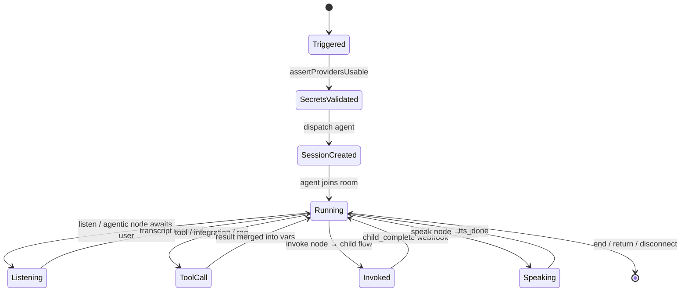
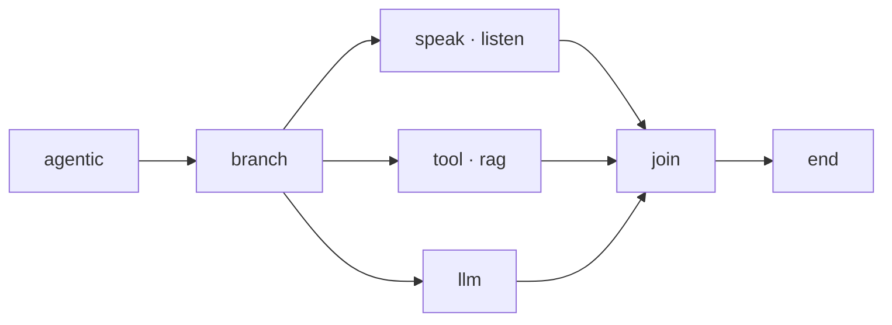
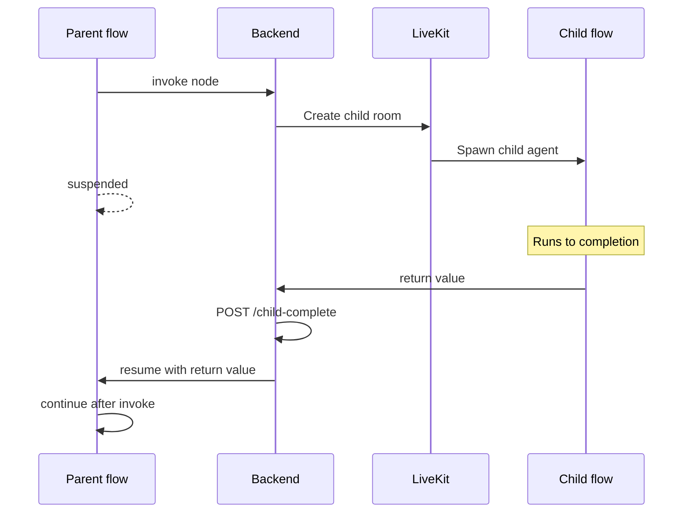
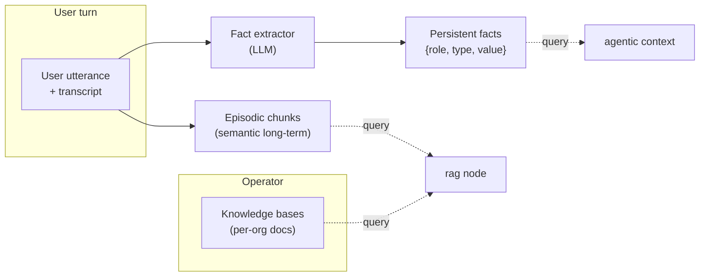

Flows are directed acyclic graphs of typed nodes. The flow executor
(`backend/src/core/flow-executor/`) runs the graph, streams events over
LiveKit data channels to the agent worker, and persists session state
in PostgreSQL.

## Execution model

The FlowExecutor is **stateless per request**; state lives in PostgreSQL
and is reconstructed on each invocation. A single call processes until
the flow yields on a user input or completes. Long conversations run as
many executor calls, driven by inbound events (transcripts, tool
callbacks, child-flow completions).

## Node types

16 node executors registered in `NodeRegistry`:

<AccordionGroup>
  <Accordion title="Core (3)">
    | Node | Purpose |
    |---|---|
    | `start` | Entry point, initial variable bindings |
    | `end` | Terminal node, completes the session |
    | `message` | Non-spoken log entry in the transcript |
  </Accordion>
  <Accordion title="Audio I/O (2)">
    | Node | Purpose |
    |---|---|
    | `speak` | Sends text through TTS to the caller |
    | `listen` | Awaits user utterance; captures transcript into a variable |
  </Accordion>
  <Accordion title="Control flow (4)">
    | Node | Purpose |
    |---|---|
    | `condition` | Branches on guard expressions over variables |
    | `wait` | Delay-based pause |
    | `pause` | Explicit pause awaiting operator resume |
    | `disconnect` | Terminates the call |
  </Accordion>
  <Accordion title="LLM / tools (3)">
    | Node | Purpose |
    |---|---|
    | `agentic` | LLM-driven multi-route decision node |
    | `llm` | Single-shot LLM call (non-agentic) |
    | `toolExecutor` | Invokes a configured tool (HTTP / webhook / MCP) |
  </Accordion>
  <Accordion title="External (4)">
    | Node | Purpose |
    |---|---|
    | `integration` | Calls a Nango-backed integration action |
    | `rag` | Retrieval-augmented search over a knowledge base |
    | `handoff` | Transfers the call (bridge to another number) |
    | `invoke` | Invokes a sub-flow in a child room; parent suspends |
    | `return` | Returns a value to the parent flow after invocation |
  </Accordion>
</AccordionGroup>

## Parallel branches

`branch` nodes split execution into N concurrent branches within one
executor call. Branches communicate via an in-memory `BranchSignalBus`
scoped to the current request — siblings can signal one another but
state doesn't cross request boundaries.

## Invoke → return (sub-flows)

Parent suspends in a persistent state; child spawns in a separate
LiveKit room. When the child completes, it hits the backend with
`POST /api/calls/sessions/:childId/child-complete`, which resumes the
parent.

## Storage

Flows are stored as JSON in the `flows.definition` JSONB column, schema
validated with Zod (`backend/flow-schema/`). Versioning is application-
level via the `flow_versions` table — no Git integration. Flows can be
exported via the API and committed to Git by the operator if desired.

## Channel integration

| Channel | Transport | Status |
|---|---|---|
| `voice` | LiveKit WebRTC / SIP | implemented |
| `whatsapp` | Meta Cloud API | implemented |
| `web` | — | not implemented |

Channel-specific prompt hints are injected into the LLM context
(`backend/src/core/flow-executor/utils/channelConfig.ts`). Voice flows
get SSML / inline tag guidance; chat flows get markdown guidance.

## Tools

`ToolExecutorNode` supports:

| Type | Route / mechanism |
|---|---|
| Custom TypeScript handlers | Registered in the tool registry |
| cURL import | `POST /api/tools/import/curl` |
| OpenAPI import | `POST /api/tools/import/openapi` |
| MCP discovery | `POST /api/tools/mcp/discover` |
| MCP test | `POST /api/tools/mcp/test` |
| Webhook callback | `POST /webhooks/tools/:token` (HMAC-signed) |

Tool secrets live in `organization_secrets`, injected at invocation time.

## Memory

Three layers, all backed by pgvector (`<=>` cosine similarity).

### Episodic memory
Long-term semantic chunks. Each user turn can be chunked, embedded, and
stored with a TTL and optional cluster tag.
- `GET /api/memory/retrieve` — fetch by user / cluster
- `GET /api/memory/search` — semantic search

### Persistent user facts
Extracted after each turn by `factExtractionService.ts`. Shape:
`{ role, type, value, source }` keyed to `user_id`. Newer extractions
supersede older ones.

### Knowledge bases
Per-org document collections; ingestion chunks + embeds, retrieval via
the `rag` node. Queries parallelize across sub-queries
(`RagNodeExecutor.ts`).

Embeddings are generated via Ollama's `embeddinggemma` model (768-dim,
configurable through `OLLAMA_EMBEDDING_MODEL`).

## Sessions

Every flow run is a row in `execution_sessions` with full variable
state, tool-call log, and final status:

| Operation | Route |
|---|---|
| List | `GET /api/monitoring/calls/history` |
| Inspect | `GET /api/sessions/:sessionId` |
| Export | `scripts/flow/export-session.ts` |
| End externally | `POST /api/sessions/:sessionId/end` |
| Resume (HTTP test) | `scripts/flow/test-flow.ts --http --session <id>` |
