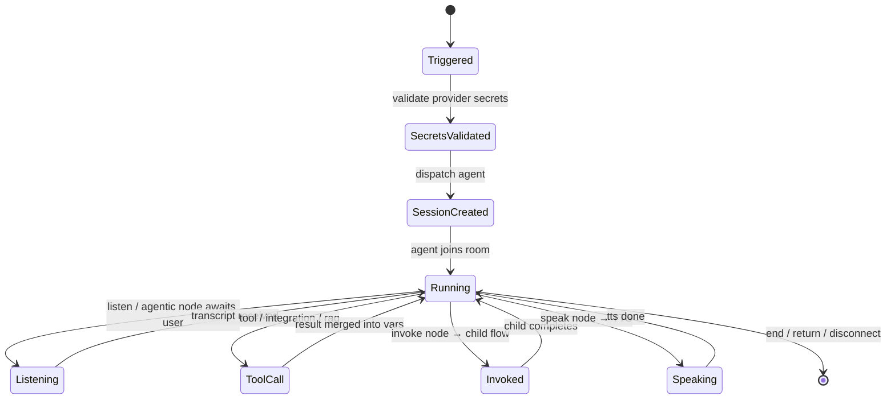
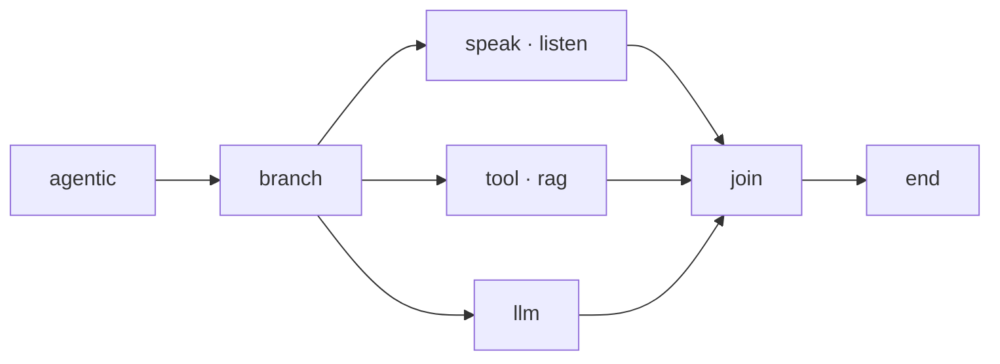
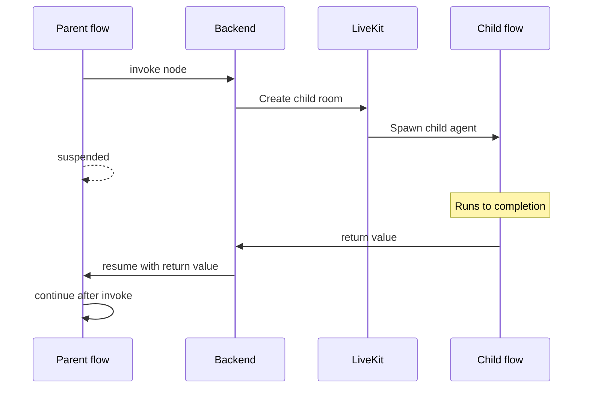
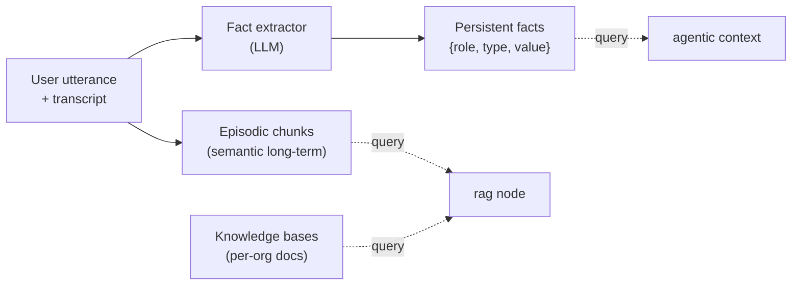

Flows are directed acyclic graphs of typed nodes. The flow executor
runs the graph, streams events to the agent worker over LiveKit data
channels, and persists session state in PostgreSQL.

## Execution model

The executor is **stateless per request** — every invocation
reconstructs state from PostgreSQL. A long conversation runs as many
short executor calls, driven by inbound events (transcripts, tool
callbacks, child-flow completions). This makes scale-out
straightforward: any backend pod can pick up the next event.

## Node types

16 node types organised by purpose:

<AccordionGroup>
  <Accordion title="Core (3)">
    | Node | Purpose |
    |---|---|
    | `start` | Entry point, initial variable bindings |
    | `end` | Terminal node, completes the session |
    | `message` | Non-spoken log entry in the transcript |
  </Accordion>
  <Accordion title="Audio I/O (2)">
    | Node | Purpose |
    |---|---|
    | `speak` | Sends text through TTS to the caller |
    | `listen` | Awaits user utterance; captures transcript into a variable |
  </Accordion>
  <Accordion title="Control flow (4)">
    | Node | Purpose |
    |---|---|
    | `condition` | Branches on guard expressions over variables |
    | `wait` | Delay-based pause |
    | `pause` | Explicit pause awaiting operator resume |
    | `disconnect` | Terminates the call |
  </Accordion>
  <Accordion title="LLM / tools (3)">
    | Node | Purpose |
    |---|---|
    | `agentic` | LLM-driven multi-route decision node |
    | `llm` | Single-shot LLM call (non-agentic) |
    | `toolExecutor` | Invokes a configured tool (HTTP / webhook / MCP) |
  </Accordion>
  <Accordion title="External (4)">
    | Node | Purpose |
    |---|---|
    | `integration` | Calls a Nango-backed integration action |
    | `rag` | Retrieval-augmented search over a knowledge base |
    | `handoff` | Transfers the call (bridge to another number) |
    | `invoke` | Invokes a sub-flow in a child room; parent suspends |
    | `return` | Returns a value to the parent flow after invocation |
  </Accordion>
</AccordionGroup>

## Parallel branches

`branch` nodes split execution into N concurrent branches within one
executor call. Branches can signal one another within the request;
state doesn't cross request boundaries.

## Invoke → return (sub-flows)

A parent flow can invoke a child flow, suspending until the child
completes:

Useful for: pre-screening / qualification flows, hand-offs to a
specialised assistant, retry-with-different-model patterns.

## Storage + versioning

Flows are stored as JSON, schema-validated at write time. Versioning is
application-level — every save creates a new version row. Flows can be
exported via the API for Git-tracked operator workflows.

## Channels

| Channel | Transport | Status |
|---|---|---|
| Phone | SIP via LiveKit SIP + telephony provider | implemented |
| WhatsApp | Meta Cloud API | implemented |
| Web widget | — | not implemented |

Channel-specific prompt hints are injected into the LLM context. Voice
flows get SSML / inline-tag guidance; chat flows get markdown
guidance — same flow definition, different rendering hint.

## Tools

The `toolExecutor` node supports:

| Type | How it's authored |
|---|---|
| Custom TypeScript handlers | Registered in the tool registry |
| cURL import | Paste a cURL command; AICO infers the schema |
| OpenAPI import | Point at an OpenAPI spec |
| MCP discovery + test | Register an MCP server, browse its tools |
| Webhook callback | HMAC-signed callback for asynchronous tools |

Tool secrets are scoped per organization, injected at invocation time.

## Memory

Three layers, all backed by pgvector cosine similarity:

- **Episodic memory** — long-term semantic chunks of user turns. Each
  turn can be chunked, embedded, and stored with a TTL and optional
  cluster tag.
- **Persistent user facts** — extracted after each turn. Newer
  extractions supersede older ones.
- **Knowledge bases** — per-org document collections; ingestion
  chunks + embeds, retrieval through the `rag` node. Queries
  parallelise across sub-queries.

## Sessions

Every flow run is persisted with full variable state, tool-call log,
and final status. Operators can list, inspect, export, end, or resume
sessions through the dashboard or the REST API (see [API
reference](/api)).
