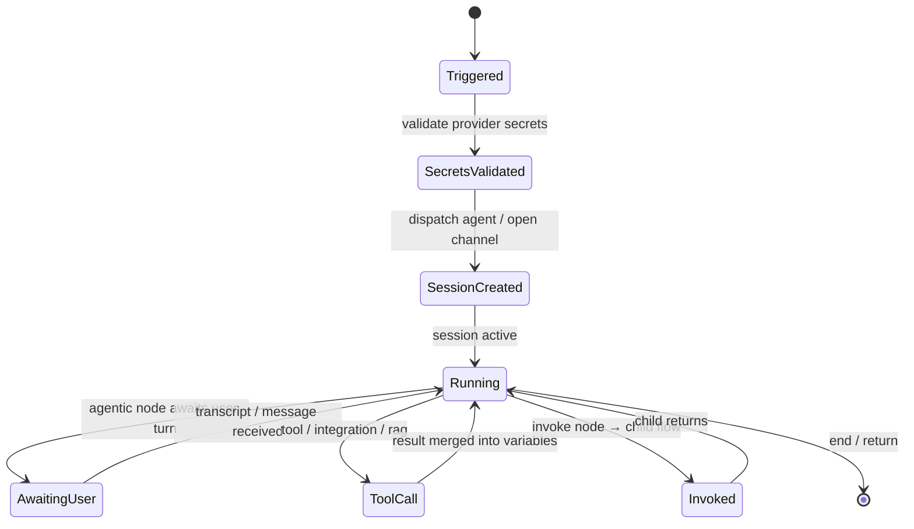
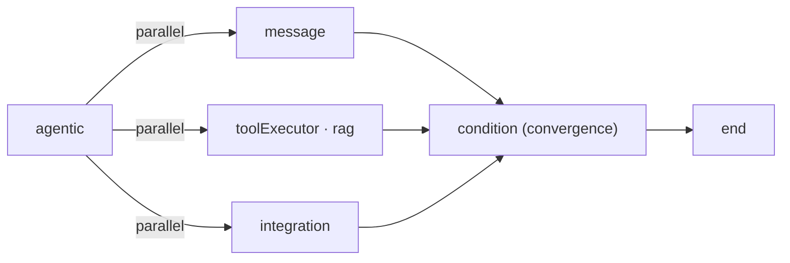
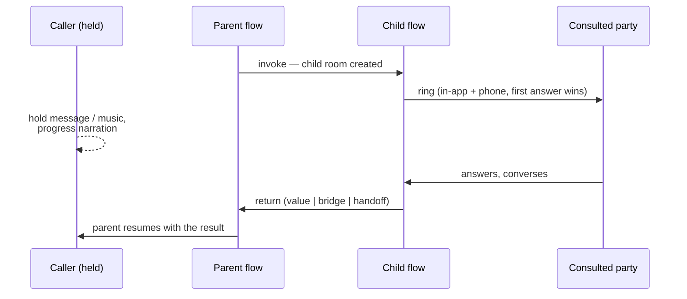
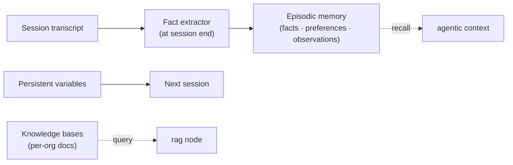

Flows are directed graphs of typed nodes. The flow executor runs the
graph, streams events to the conversation surface, and persists
session state in PostgreSQL.

## Execution model

```mermaid
stateDiagram-v2
    [*] --> Triggered
    Triggered --> SecretsValidated: validate provider secrets
    SecretsValidated --> SessionCreated: dispatch agent / open channel
    SessionCreated --> Running: session active
    Running --> AwaitingUser: agentic node awaits user turn
    AwaitingUser --> Running: transcript / message received
    Running --> ToolCall: tool / integration / rag
    ToolCall --> Running: result merged into variables
    Running --> Invoked: invoke node → child flow
    Invoked --> Running: child returns
    Running --> [*]: end / return
```

The executor is **stateless per request** — every invocation
reconstructs state from PostgreSQL. A long conversation runs as many
short executor calls, driven by inbound events (transcripts, tool
callbacks, child-flow completions). This makes scale-out
straightforward: any backend instance can pick up the next event.

## Node types

15 node types organised by purpose:

<AccordionGroup>
  <Accordion title="Core (9)">
    | Node | Purpose |
    |---|---|
    | `start` | Entry point; declares the flow's typed input contract (caller-supplied, channel-derived, or auto-generated inputs) |
    | `end` | Terminates the flow; archives the transcript and persists variables |
    | `message` | Sends output to the user — a static template with variable interpolation, or LLM-generated. Can deliver on a side channel (e.g. text a link during a voice call) |
    | `condition` | Branches on an expression, or N labelled branches |
    | `wait` | Fixed delay with an optional filler message; auto-cancels when a parallel sibling starts responding |
    | `pause` | Puts the user on hold (hold music on voice, waiting state in chat) |
    | `disconnect` | Drops the user from the channel while the flow continues headless; can keep the room open for a later re-attach |
    | `reach` | Re-establishes contact after a disconnect — dials the user back on voice, validates the messaging window on chat channels. Ports: connected / no answer / rejected / error |
    | `handoff` | Hands the conversation to another party (phone number, SIP URI, or a person in the organization); the flow continues headless |
  </Accordion>
  <Accordion title="LLM (1)">
    | Node | Purpose |
    |---|---|
    | `agentic` | The conversational engine: routing, variable extraction, and response generation in one LLM-driven node. Awaits user turns, extracts typed variables, and picks the next route |
  </Accordion>
  <Accordion title="Tools & knowledge (3)">
    | Node | Purpose |
    |---|---|
    | `toolExecutor` | Invokes a configured tool with parameter bindings from flow variables |
    | `integration` | Calls an external integration action (CRM, calendar, …) through the authenticated integration proxy |
    | `rag` | Hybrid retrieval (vector + keyword + fuzzy, rank-fused) over the organization's knowledge bases. Ports: found / not found |
  </Accordion>
  <Accordion title="Composition (2)">
    | Node | Purpose |
    |---|---|
    | `invoke` | Spawns a child flow in its own room; can ring people, hold the caller, and narrate progress |
    | `return` | Completes a child flow back to its parent — return a value, bridge the caller to the consulted party, or hand off externally |
  </Accordion>
</AccordionGroup>

## Variables

The `agentic` node extracts typed variables from the conversation:
`string`, `number`, `boolean`, `date`, `phone`, `email`, and `image`.

- **Asked vs derived** — a variable with a prompt is asked of the
  user; a variable marked *derived* is authored by the assistant from
  context and never asked (e.g. a ticket subject line).
- **Image variables** are filled by the runtime from media the user
  sends — never by the LLM.
- **Persistent variables** survive across sessions for the same user.
- Whether a variable is required is decided per edge: an edge can
  require variables (or a photo on the current turn) before it can be
  traversed.

## Parallel execution

Parallelism is expressed on the graph itself: multiple edges leaving
the same port, marked parallel, fan out into concurrent branches. The
engine computes where the branches reconverge and merges their
results.

```mermaid
flowchart LR
    A["agentic"] -- parallel --> C1["message"]
    A -- parallel --> C2["toolExecutor · rag"]
    A -- parallel --> C3["integration"]
    C1 --> D["condition (convergence)"]
    C2 --> D
    C3 --> D
    D --> E["end"]
```

Branches coordinate at runtime: only one branch speaks to the user at
a time (the first to produce output wins the voice), and `wait` nodes
in sibling branches cancel automatically when another branch starts
responding.

## Invoke → return (child flows)

A parent flow can invoke a child flow — the pattern behind
consultations, relays, and warm transfers:

```mermaid
sequenceDiagram
    participant Caller as Caller (held)
    participant P as Parent flow
    participant C as Child flow
    participant T as Consulted party

    P->>C: invoke — child room created
    C->>T: ring (in-app + phone, first answer wins)
    Caller-->>Caller: hold message / music,<br/>progress narration
    T->>C: answers, converses
    C->>P: return (value | bridge | handoff)
    P->>Caller: parent resumes with the result
```

- **Ringing** — a dial target is a *person*, not a device: ringing
  reaches all their endpoints (in-app notification on every signed-in
  device + their phone number); the first answer wins. Multiple
  targets can ring in parallel or sequentially.
- **Hold + narration** — the original caller can be held with a
  message or music, and the parent can narrate child progress
  ("I'm reaching your advisor now…") driven by child lifecycle
  events.
- **Completion types** — `return` (the agent comes back to the caller
  with a result), `bridge` (the caller is connected directly to the
  consulted party), or `handoff` (external transfer).
- **Keep-alive** — a child can be kept alive after returning, so a
  follow-up invoke reconnects the same consulted party without
  ringing again.

## Tools

The `toolExecutor` node runs configured tools:

| Type | What it is |
|---|---|
| HTTP | Declarative HTTP call with bearer / basic / API-key auth, secret interpolation, and response mapping |
| Code | A sandboxed handler executed in an isolated worker |
| MCP | Tools discovered from a registered MCP server (SSE or streamable HTTP) |
| Built-in | Platform-provided actions |
| Pipeline | Composition of other tools |

Tools are authored directly, imported from a **cURL command**, or
imported from an **OpenAPI spec**. Tool secrets are scoped per
organization and injected at invocation time — flow definitions never
contain credentials.

**Asynchronous tools**: a tool that reports async completion either
routes the flow onward immediately on a *pending* port or parks the
session; your system resumes it later by calling a single-use,
HMAC-signed callback URL.

## Memory

Three layers, all backed by pgvector:

```mermaid
flowchart LR
    UT["Session transcript"] --> FX["Fact extractor<br/>(at session end)"]
    FX --> EP["Episodic memory<br/>(facts · preferences · observations)"]
    PV["Persistent variables"] --> NS["Next session"]
    KB["Knowledge bases<br/>(per-org docs)"]
    EP -.recall.-> AGC["agentic context"]
    KB -.query.-> RAG["rag node"]
```

- **Episodic memory** — at session end, an extraction pass turns the
  transcript into individually embedded facts, preferences, and
  observations, recalled in later conversations.
- **Persistent variables** — flow variables marked persistent are
  restored at the start of the user's next session.
- **Knowledge bases** — per-organization document collections;
  ingestion chunks and embeds, retrieval through the `rag` node.

Identity is unified across channels — the same phone number on voice,
SMS, and WhatsApp maps to one memory profile, and anonymous web
memory is merged into the verified identity once the visitor is
identified.

## Storage + versioning

Flows are stored as JSON and schema-validated at write time. Every
save appends an immutable version snapshot with author and optional
release notes; version numbers are gapless per flow. Rollback writes
the selected snapshot back as a *new* version — history is never
mutated. Flows can be exported via the API for Git-tracked operator
workflows.

## Sessions

Every flow run is persisted with full variable state, tool-call log,
and final status. Operators can list, inspect, export, end, or resume
sessions through the dashboard or the REST API (see [API
reference](/api)).
