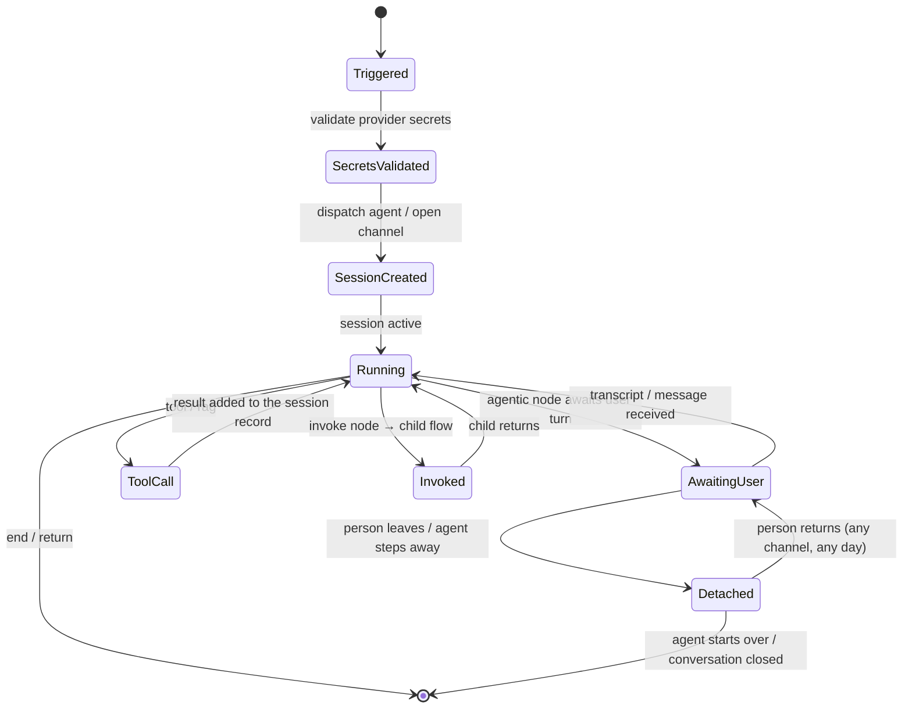
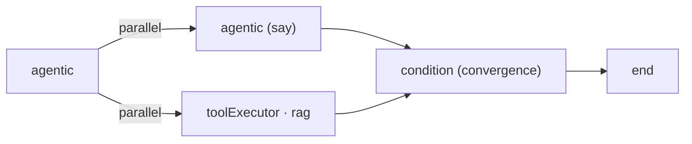
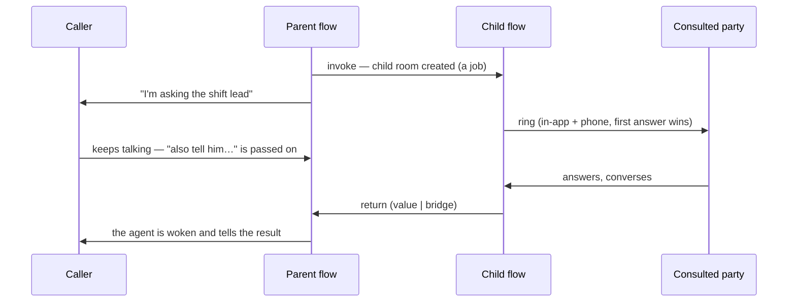
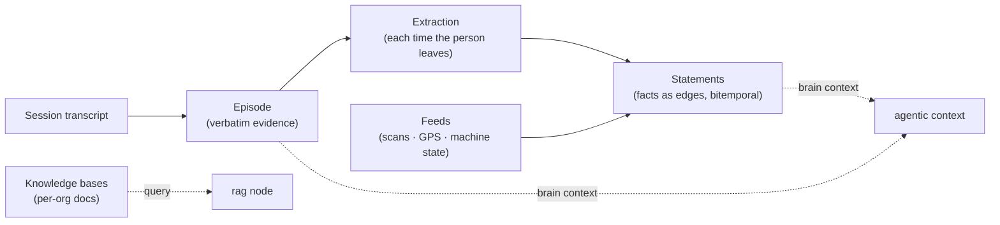

Flows are directed graphs of typed nodes. The flow executor runs the
graph, streams events to the conversation surface, and persists
session state in PostgreSQL.

## Execution model

```mermaid
stateDiagram-v2
    [*] --> Triggered
    Triggered --> SecretsValidated: validate provider secrets
    SecretsValidated --> SessionCreated: dispatch agent / open channel
    SessionCreated --> Running: session active
    Running --> AwaitingUser: agentic node awaits user turn
    AwaitingUser --> Running: transcript / message received
    AwaitingUser --> Detached: person leaves / agent steps away
    Detached --> AwaitingUser: person returns (any channel, any day)
    Running --> ToolCall: tool / rag
    ToolCall --> Running: result added to the session record
    Running --> Invoked: invoke node → child flow
    Invoked --> Running: child returns
    Running --> [*]: end / return
    Detached --> [*]: agent starts over / conversation closed
```

The executor is **stateless per request** — every invocation
reconstructs state from PostgreSQL. A long conversation runs as many
short executor calls, driven by inbound events (transcripts, tool
callbacks, child-flow completions). This makes scale-out
straightforward: any backend instance can pick up the next event.

## Node types

13 node types organised by purpose:

<AccordionGroup>
  <Accordion title="Core (7)">
    | Node | Purpose |
    |---|---|
    | `start` | Entry point; declares the flow's typed input contract (caller-supplied, channel-derived, or context inputs resolved by the runtime from a provider: identity, zone, lastSession, speaker, device) |
    | `end` | Terminates the flow and closes the conversation |
    | `condition` | Branches on an expression, or N labelled branches |
    | `wait` | Fixed delay between two steps; says nothing |
    | `disconnect` | Drops the user from the channel while the flow continues headless; can keep the room open for a later re-attach |
    | `reach` | Re-establishes contact after a disconnect — dials the user back on voice, validates the messaging window on chat channels. Ports: connected / no answer / rejected / error |
    | `handoff` | Rings a person in the organization into this conversation (the agent stays with both), or transfers a phone caller to a number or SIP URI. Runs as a job: the conversation goes on while it rings |
  </Accordion>
  <Accordion title="LLM (1)">
    | Node | Purpose |
    |---|---|
    | `agentic` | The conversational engine: response and routing in one LLM call. Awaits user turns and picks the next route; a route into a tool or child flow fills that call's parameters. Can ask the device for a photo or a scan |
  </Accordion>
  <Accordion title="Tools & knowledge (2)">
    | Node | Purpose |
    |---|---|
    | `toolExecutor` | Invokes a configured tool; the flow binds some parameters, the agent fills the rest when it routes to the node |
    | `rag` | Hybrid retrieval (vector + keyword + fuzzy, rank-fused) over the organization's knowledge bases. Ports: found / not found |
  </Accordion>
  <Accordion title="Composition (3)">
    | Node | Purpose |
    |---|---|
    | `invoke` | Spawns a child flow in its own room; can ring people, hold the caller, and narrate progress |
    | `return` | Completes a child flow back to its parent — return a value, bridge the caller to the consulted party, or hand off externally |
    | `operate` | Runs a tool as a job: the conversation goes on while it works, and the agent hears the result when it settles |
  </Accordion>
</AccordionGroup>

## Conversation state

Flows declare no variables. What a conversation knows lives in four
places, each with one owner:

- **Memory** — facts about the person (name, language, their vehicle)
  are in the brain, learned from what was said and retrieved into every
  turn. There is no per-flow persistent store.
- **The session record** — what the system produced in the
  conversation: photos and files the person sent, codes their device
  scanned, and the result of every tool, knowledge search, app operation
  and child flow. Templates read the latest of each as `@media`, `@scan`
  and `@result.<node>`. Nothing is ever cleared: what a node still asks
  for (a photo it `capture`s) and what a route already did (`once`)
  count from the node's current **visit** — from the turn the
  conversation entered it. Coming back to a node later is a new visit.
- **Contracts** — a tool's input schema, a child flow's start inputs and
  a return node's `returns` fields.
  A route into such a node *is* the call: the parameters the flow does
  not bind itself are filled by the agent from the conversation, the
  record and memory at that moment. A required parameter it cannot fill
  means it asks.

Templates and conditions read the flow's start inputs, system values
(time, language, session ids) and the session record — never
something the model was told to collect.

Edges can carry two gates: `turnHas` (this turn carries a photo, a
document or a scan) and `once` (the target has not already succeeded since
the conversation entered the routing node — a report is sent once).

## Parallel execution

Parallelism is expressed on the graph itself: multiple edges leaving
the same port, marked parallel, fan out into concurrent branches. The
engine computes where the branches reconverge and merges their
results.

```mermaid
flowchart LR
    A["agentic"] -- parallel --> C1["agentic (say)"]
    A -- parallel --> C2["toolExecutor · rag"]
    C1 --> D["condition (convergence)"]
    C2 --> D
    D --> E["end"]
```

Branches coordinate at runtime: only one branch speaks to the user at
a time (the first to produce output wins the voice).

## Invoke → return (child flows)

A parent flow can invoke a child flow — the pattern behind
consultations, relays, and warm transfers. The child runs as a **job**
beside the conversation: the caller keeps talking with the agent while
it runs, and its result wakes the agent to tell them.

```mermaid
sequenceDiagram
    participant Caller
    participant P as Parent flow
    participant C as Child flow
    participant T as Consulted party

    P->>C: invoke — child room created (a job)
    P->>Caller: "I'm asking the shift lead"
    C->>T: ring (in-app + phone, first answer wins)
    Caller->>P: keeps talking — "also tell him…" is passed on
    T->>C: answers, converses
    C->>P: return (value | bridge)
    P->>Caller: the agent is woken and tells the result
```

- **Ringing** — a dial target is a *person*, not a device: ringing
  reaches all their endpoints (in-app notification on every signed-in
  device + their phone number); the first answer wins. Multiple
  targets can ring in parallel or sequentially.
- **Never on hold** — the agent keeps the conversation while the child
  runs: it can look in, pass something on, or call it off, and on a
  phone line it may play music for a long wait. Every client sees the
  job's status (`job.updated`: ringing, who picked up, done).
- **Completion types** — `return` (the agent tells the caller the
  result), or `bridge` (the caller is connected directly to the
  consulted party).

## Tools

The `toolExecutor` node runs configured tools:

| Type | What it is |
|---|---|
| HTTP | Declarative HTTP call with bearer / basic / API-key auth, secret interpolation, and response mapping |
| Code | A sandboxed handler executed in an isolated worker |
| MCP | Tools discovered from a registered MCP server (SSE or streamable HTTP) |
| Built-in | Platform-provided actions |
| Pipeline | Composition of other tools |

Tools are authored directly, imported from a **cURL command**, or
imported from an **OpenAPI spec**. Tool secrets are scoped per
organization and injected at invocation time — flow definitions never
contain credentials.

**Asynchronous tools**: a tool that reports async completion runs as a
job — the conversation continues (on its *pending* port, or back where
it was), and your system answers later by calling a single-use,
HMAC-signed callback URL; the answer wakes the agent to tell the user.

## Memory — the brain

One knowledge graph per organization. Every person has a personal
brain, the organization has a company brain; both live in the same
graph, separated by scope.

```mermaid
flowchart LR
    UT["Session transcript"] --> EP["Episode<br/>(verbatim evidence)"]
    EP --> FX["Extraction<br/>(each time the person leaves)"]
    FX --> ST["Statements<br/>(facts as edges, bitemporal)"]
    FD["Feeds<br/>(scans · GPS · machine state)"] --> ST
    KB["Knowledge bases<br/>(per-org docs)"]
    ST -.brain context.-> AGC["agentic context"]
    EP -.brain context.-> AGC
    KB -.query.-> RAG["rag node"]
```

- **Episodes** — the transcript is kept verbatim as evidence; every
  fact links back to the conversation it came from.
- **Statements** — atomic facts about people, assets, locations,
  processes: subject, predicate, object or value, with the time they
  held and who asserted them. A new value for a one-per-subject
  predicate supersedes the old one; nothing is silently overwritten.
- **Scope** — facts tagged personal stay with the person; facts the
  flow allows to be learned (`autoLearn`) enter the company brain. A
  fact inferred about a colleague is shown to that colleague first.
- **Feeds** — external sources (a scanner, a MES, a phone's location)
  push events that map to live state without a model in the loop.
- **Knowledge bases** — per-organization document collections;
  ingestion chunks and embeds, retrieval through the `rag` node.

Identity is unified across channels — the same phone number on voice,
SMS, and WhatsApp maps to one person, and an anonymous web visitor's
open conversation and brain move to the verified identity once the
visitor is identified. A person can be forgotten entirely on request.

## Storage + versioning

Flows are stored as JSON and schema-validated at write time. Every
save appends an immutable version snapshot with author and optional
release notes; version numbers are gapless per flow. Rollback writes
the selected snapshot back as a *new* version — history is never
mutated. Flows can be exported via the API for Git-tracked operator
workflows.

## Sessions

A session is a **conversation**: every person — signed in, a phone
number, an anonymous web visitor — has at most one open conversation
per flow, with no expiry. Leaving (a call that drops, a closed tab, an
agent stepping away after silence) pauses it, and the person's next
call, message or visit continues it, on any channel. On their return
the agent decides whether to pick up where it stopped or start over. A conversation also ends when its flow ends it, the agent
starts over, or somebody closes it.

Each call or connection of a conversation is recorded on its own, with
its duration, recording and call status. Durations, voice minutes and
costs count the time somebody was connected, not how long the
conversation stayed open. Every conversation is persisted with its
session record, tool-call log, and final status. Operators can list,
inspect, export, or end sessions through the dashboard or the REST
API (see [API reference](/api)).
