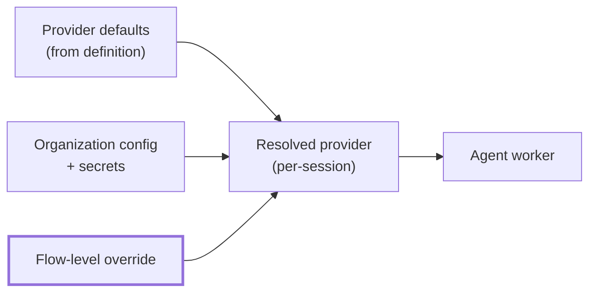
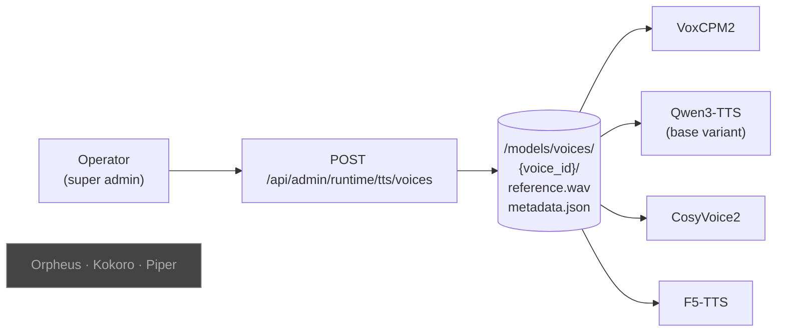
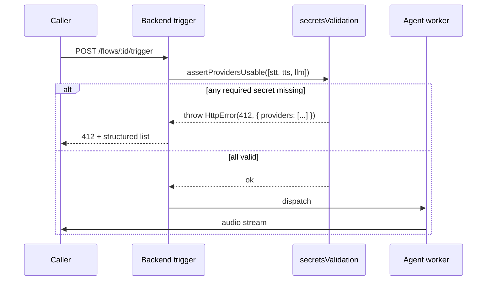

Three catalogs in `backend/src/providers/definitions/` — `stt.ts`,
`tts.ts`, `llm.ts`. Each provider has a `configSchema` (per-flow fields),
a `secretsSchema` (per-org), and a unique key. The agent-worker factory
(`agent-worker/providers/factory.py`) instantiates them at session start.

## Provider resolution

Priority: **flow > organization > default**. All three are merged into
a single `EffectiveProviderConfig` with a `validation` field attached so
the UI can flag missing required secrets without failing the request.

## STT providers (9)

| Key | Hosting | Instantiation |
|---|---|---|
| `deepgram` | Cloud | LiveKit `deepgram.STT` |
| `gladia` | Cloud | LiveKit `gladia.STT` |
| `openai-stt` | Cloud | LiveKit `openai.STT` |
| `microsoft-speech` | Cloud | LiveKit `azure.STT` |
| `groq-stt` | Cloud | LiveKit `openai.STT.with_groq` |
| `local-stt-qwen` | Self-hosted | WS → `/ws/transcribe/qwen` (Qwen3-ASR-1.7B) |
| `local-stt-cohere` | Self-hosted | WS → `/ws/transcribe/cohere` (cohere-transcribe-03-2026) |
| `local-stt-whisper` | Self-hosted | WS → `/ws/transcribe/whisper` (faster-whisper) |
| `local-stt-vosk` | Self-hosted | WS → `/ws/transcribe/vosk` |

All 9 have factory handlers.

## TTS providers (11)

| Key | Hosting | Instantiation |
|---|---|---|
| `elevenlabs` | Cloud | LiveKit `elevenlabs.TTS` |
| `cartesia` | Cloud | LiveKit `cartesia.TTS` |
| `openai-tts` | Cloud | LiveKit `openai.TTS` |
| `deepgram-tts` | Cloud | LiveKit `deepgram.TTS` (Aura-2) |
| `local-tts-voxcpm` | Self-hosted | HTTP → `/api/tts/voxcpm` |
| `local-tts-qwen` | Self-hosted | HTTP → `/api/tts/qwen` |
| `local-tts-cosyvoice` | Self-hosted | HTTP → `/api/tts/cosyvoice` |
| `local-tts-f5tts` | Self-hosted | HTTP → `/api/tts/f5tts` |
| `local-tts-orpheus` | Self-hosted | HTTP → `/api/tts/orpheus` |
| `local-tts-kokoro` | Self-hosted | HTTP → `/api/tts/kokoro` |
| `local-tts-piper` | Self-hosted | Piper gateway |

All 11 have factory handlers.

### Voice store

- **Cloning-capable** (consume the store): `voxcpm`, `qwen`, `cosyvoice`, `f5tts`
- **Preset-only** (ignore the store): `orpheus`, `kokoro`, `piper`

Provider definitions carry
`voiceManagement.voicesFromStore: true | false` so the frontend voice
picker auto-hides for preset-only engines.

<Warning>
	The store is **not tenant-scoped** — every voice is visible to every
	organization that picks a local TTS engine. Upload / delete is
	operator-only.
</Warning>

## LLM providers (10)

Keys: `openai`, `anthropic`, `google`, `groq`, `azure-openai`,
`cerebras`, `deepinfra`, `fireworks`, `qwen`, `cli-proxy`.

Local Ollama is reached via the `qwen` or `cli-proxy` provider pointed at
`http://ollama:11434`. The operator picks the specific model per flow.

## Configuration tiers

```mermaid
flowchart TB
    subgraph RT["Runtime (operator-only)"]
        direction LR
        MP["Model paths"]
        DV["Device / dtype"]
        AB["Attention backend"]
        JT["JIT / TRT / vLLM"]
        RA["ref_audio (raw FS)"]
    end

    subgraph PR["Per-request (per-flow)"]
        direction LR
        LG["Language"]
        VID["Voice ID"]
        EP["Endpointing"]
        TMP["Temperature"]
        ST["Style / emotion"]
    end

    SAP["SuperAdminPanel<br/>/ TUI"] --> RT
    FC["Flow config UI"] --> PR

    style RT fill:#3b2e2e,stroke:#f44
    style PR fill:#2e3b2e,stroke:#4f4
```

Runtime fields live in each engine's `runtime_schema()` and never surface
in the per-flow UI. Per-request fields live in `request_schema()`. The
split is enforced at the service boundary — the per-flow API will reject
runtime fields.

## Endpointing (self-hosted STT)

Qwen, Cohere, and Whisper emit `FINAL_TRANSCRIPT` via server-side RMS
silence detection. Exposed per flow:

| Field | Default | Range | Purpose |
|---|---|---|---|
| `endpointingMs` | 600 | 100 – 5000 | silence after speech before emitting final |
| `silenceThreshold` | 0.015 | 0 – 0.5 | RMS level below which audio counts as silence |

Cloud STTs expose their own vendor equivalents
(Deepgram: `endpointingMs`, Gladia: `endpointing` in seconds). Vosk uses
its native `endpointer_mode` (runtime-level).

<Note>
	LiveKit's `commit_user_turn` does **not** push silence frames into the
	STT in live voice sessions (`audio_detached=False`). The STT must
	self-endpoint — the `commit_user_turn` silence fallback only fires
	when `audio_detached=True` (text-mode harness).
</Note>

## Secrets handling

| Aspect | Implementation |
|---|---|
| Storage | `organization_secrets.secrets` JSONB |
| At-rest encryption | **Not applied at the app layer** — configure at disk/PostgreSQL level if required |
| In transit | TLS between backend and providers; M2M HTTPS to agent worker |
| Frontend exposure | Redacted in every API response |
| Rotation | `PUT /api/providers/:key/secrets` — writes a new value |

## Fail-fast validation

At flow trigger (`flowTriggerService.ts`), every effective provider is
validated against `secretsSchema.required`. Missing keys raise HTTP 412
before the agent worker is dispatched, with a structured list of
misconfigured providers — preventing opaque SDK-side 401s inside a live
call.

Dashboard reads also receive the `validation: { valid, missingSecrets[] }`
field so the UI can flag misconfigured providers without failing the
request.
