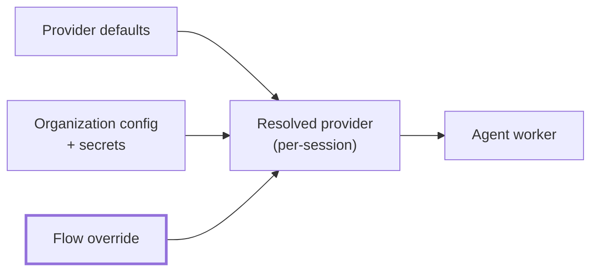
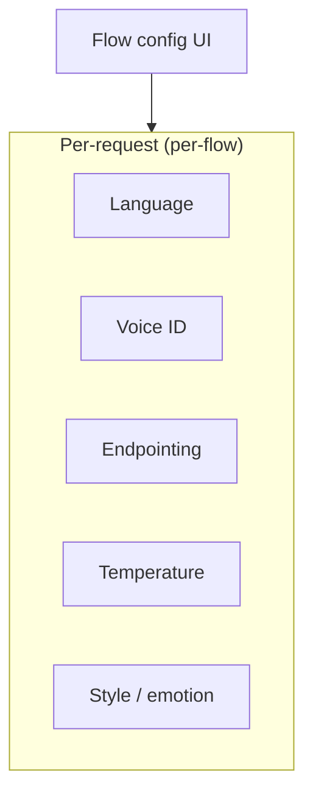
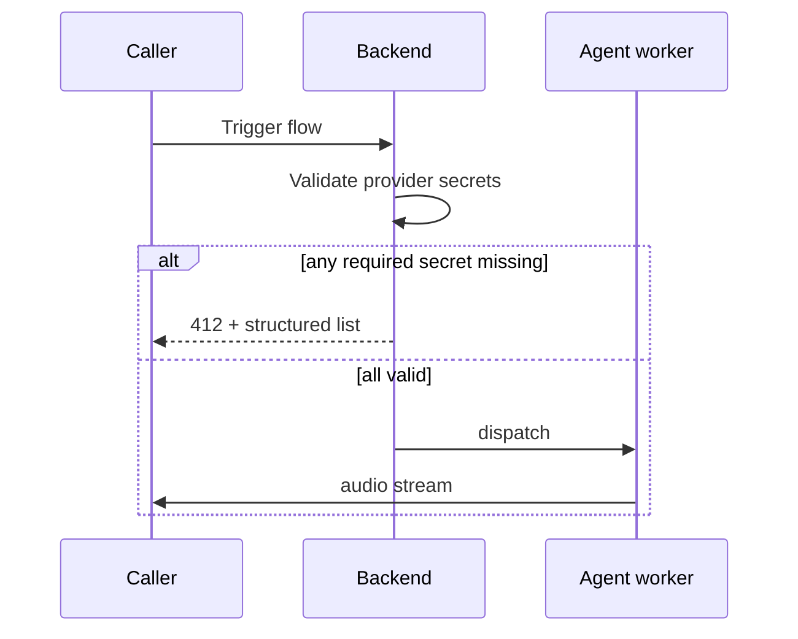

AICO ships with cloud and self-hosted speech and language providers.
Each provider has a per-flow config schema, a per-org secrets schema,
and a unique key. Selection happens per flow; resolution merges
defaults → organization → flow.

## Provider resolution

Priority: **flow > organization > default**. Required secrets are
validated at flow trigger; missing keys raise HTTP 412 before the
agent worker starts — preventing opaque mid-call SDK errors.

## STT providers (9)

| Key | Hosting |
|---|---|
| `deepgram` | Cloud |
| `gladia` | Cloud |
| `openai-stt` | Cloud |
| `microsoft-speech` | Cloud |
| `groq-stt` | Cloud |
| `local-stt-qwen` | Self-hosted (Qwen3-ASR-1.7B) |
| `local-stt-cohere` | Self-hosted (Cohere Transcribe) |
| `local-stt-whisper` | Self-hosted (faster-whisper) |
| `local-stt-vosk` | Self-hosted (Vosk) |

## TTS providers (11)

| Key | Hosting |
|---|---|
| `elevenlabs` | Cloud |
| `cartesia` | Cloud |
| `openai-tts` | Cloud |
| `deepgram-tts` | Cloud (Aura-2) |
| `local-tts-voxcpm` | Self-hosted, voice cloning |
| `local-tts-qwen` | Self-hosted (Qwen3-TTS), voice cloning |
| `local-tts-cosyvoice` | Self-hosted (CosyVoice2), voice cloning |
| `local-tts-f5tts` | Self-hosted (F5-TTS), voice cloning |
| `local-tts-orpheus` | Self-hosted, preset voices |
| `local-tts-kokoro` | Self-hosted, preset voices |
| `local-tts-piper` | Self-hosted, preset voices |

### Voice store

Cloning-capable engines (`voxcpm`, `qwen`, `cosyvoice`, `f5tts`) share
a voice library: upload a reference clip once, use the resulting
`voice_id` from any cloning engine. Preset-only engines (`orpheus`,
`kokoro`, `piper`) ignore the store.

The frontend voice picker auto-hides for preset-only engines based on
each provider's declared capabilities.

## LLM providers (10)

Cloud: `openai`, `anthropic`, `google`, `groq`, `azure-openai`,
`cerebras`, `deepinfra`, `fireworks`. Self-hosted: `qwen` (Ollama-
compatible), `cli-proxy` (vendor CLIs as OpenAI-shaped proxies).

Local Ollama is reached via the `qwen` or `cli-proxy` provider; the
operator picks the specific model per flow.

## Configuration tiers

Per-flow fields cover everything an org admin tunes: language, voice,
endpointing, temperature, style. Engine-internal settings (model
paths, GPU device, attention backend) are operator-only and stay out
of the per-flow UI — the API will reject them on a per-flow call
regardless of caller role.

## Endpointing (self-hosted STT)

Self-hosted streaming STT engines emit a final transcript via
server-side silence detection. Two per-flow knobs:

| Field | Default | Range | Purpose |
|---|---|---|---|
| `endpointingMs` | 600 | 100 – 5000 | silence after speech before emitting final |
| `silenceThreshold` | 0.015 | 0 – 0.5 | RMS level below which audio counts as silence |

Cloud STTs expose their own vendor equivalents (Deepgram:
`endpointingMs`; Gladia: `endpointing` in seconds).

## Secrets handling

| Aspect | Implementation |
|---|---|
| Storage | Encrypted at the database / volume layer (operator-configured) |
| In transit | TLS to providers; M2M HTTPS to the agent worker |
| Frontend exposure | Redacted in every API response |
| Rotation | Single API call writes a new value |

## Fail-fast validation

At flow trigger every effective provider is validated against its
required secrets. Missing keys raise HTTP 412 with a structured list
of misconfigured providers — preventing opaque vendor 401s mid-call.

Dashboard reads also receive a `validation` field so the UI can flag
misconfigured providers without failing the request.
