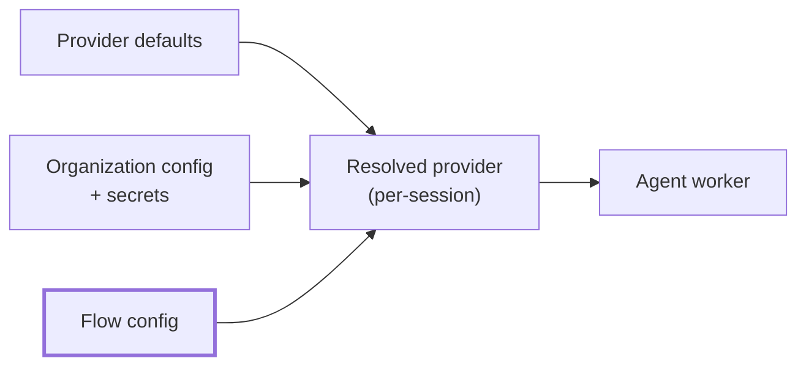
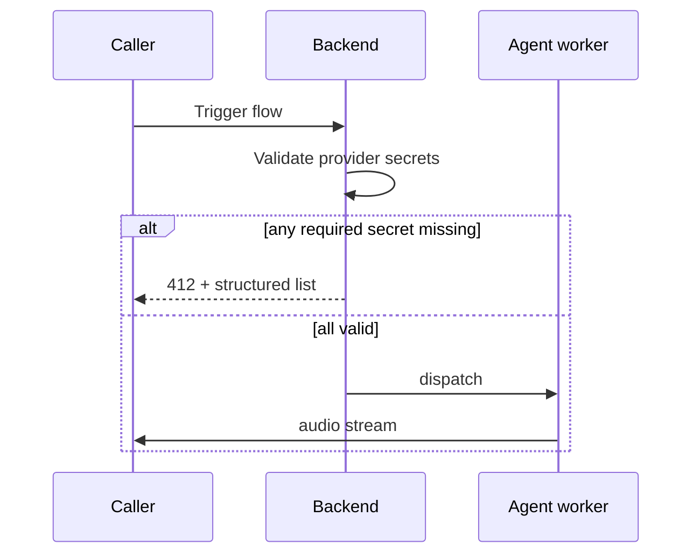

Mandy ships with cloud and self-hosted speech and language providers.
Cloud providers are part of the platform catalog; self-hosted
providers are published dynamically by the inference services actually
deployed with your instance — so the local catalog always reflects
what your deployment can really run.

## Provider resolution

Each flow **selects** its STT, TTS, and LLM provider. Configuration
for the selected provider merges three layers:

```mermaid
flowchart LR
    D["Provider defaults"] --> M
    O["Organization config<br/>+ secrets"] --> M
    F["Flow config"] --> M
    M["Resolved provider<br/>(per-session)"] --> AGT["Agent worker"]
    style F stroke-width:3px
```

Config precedence: **flow > organization > provider defaults**. The
organization supplies credentials and shared defaults; the flow picks
the provider and tunes it per use case. Required secrets are validated
at flow trigger; missing keys raise HTTP 412 before the agent worker
starts — preventing opaque mid-call SDK errors.

## STT providers

### Cloud

| Key | Vendor | Notes |
|---|---|---|
| `deepgram` | Deepgram | Nova-3 family; diarization, PII redaction, key terms |
| `gladia` | Gladia | Solaria-1; 100+ languages, code-switching, live translation |
| `openai-stt` | OpenAI | gpt-4o-transcribe family, whisper-1 |
| `microsoft-speech` | Azure Speech | Includes phoneme-level pronunciation assessment |
| `groq-stt` | Groq | whisper-large-v3-turbo / v3 |

### Self-hosted

Self-hosted models appear as `local-stt-<model>` providers, published
by the deployed STT service. The current engine catalog:

| Engine | Models | Notes |
|---|---|---|
| Whisper (faster-whisper) | `whisper-large-v3` (default), `whisper-distil-large-v3`, `whisper-tiny` | Multi-language; the distil variant is English-only and ~6× faster |
| Qwen3-ASR | `qwen3-asr-1.7b` | Streaming, 52 languages, automatic language detection |
| Cohere Transcribe | `cohere-transcribe` | 14 languages, long-form chunking |
| Vosk | `vosk-de` | CPU-only, fully offline, streaming |
| emotion2vec | `emotion2vec-base`, `emotion2vec-large` | **Paralinguistic sidecar** — emotion + sentiment per utterance, runs alongside a transcribing engine |

Which models are available depends on the deployment: each instance
enables the models its hardware supports (CPU, CUDA, or ROCm builds).

## TTS providers

### Cloud

| Key | Vendor | Notes |
|---|---|---|
| `elevenlabs` | ElevenLabs | Live voice catalog |
| `cartesia` | Cartesia | Live voice catalog |
| `openai-tts` | OpenAI | Preset voices |
| `deepgram-tts` | Deepgram | Aura-2 |

### Self-hosted

Published as `local-tts-<model>`:

| Engine | Model | Voice cloning |
|---|---|---|
| Piper | `piper-de` | No (preset, CPU-only) |
| Kokoro | `kokoro` | No (presets, CPU-friendly) |
| Qwen3-TTS | `qwen3-tts` | Yes |
| Orpheus | `orpheus-3b` | No (presets, style control) |
| CosyVoice2 | `cosyvoice2` | Yes, with instruction control |
| F5-TTS | `f5tts` | Yes |
| VoxCPM | `voxcpm-2b` | Yes, plus voice design, 48 kHz |

### Voices

Cloning-capable engines synthesize with a `voice_id` referencing a
reference recording provisioned on the instance. The voice library is
managed at the deployment level by the operator — treat cloned voices
as operator-managed assets, not per-flow uploads. Preset engines
expose their built-in voices directly in the flow config.

## LLM providers

### Cloud

`openai`, `anthropic`, `google`, `groq`, `azure-openai`, `cerebras`,
`deepinfra`, `fireworks`, `qwen` (Alibaba Cloud), `ollama` (bring
your own Ollama endpoint), and `cli-proxy` (vendor CLIs exposed as an
OpenAI-shaped proxy). Model catalogs per provider are maintained in
the platform and selectable per flow.

### Self-hosted

The LLM inference plane runs **vLLM** with a per-model catalog,
published as `local-llm-<model>`. Current catalog includes
Ling-2.6-flash (full, FP8, and INT4 quantizations), Gemma 3
(27B / 12B / 4B), Qwen3 (30B-A3B, 8B), GPT-OSS-20B, and Llama-4
Scout. All local models speak the OpenAI-compatible chat API with
streaming and tool calling.

## Conversation tuning (voice)

Two layers of tuning govern voice turn-taking:

### Flow-level voice settings

Per-flow controls for the live voice pipeline, all optional with
sensible defaults:

- **Turn detection** — semantic turn-detector threshold, minimum and
  maximum endpointing delay.
- **Voice activity detection** — activation threshold, minimum
  speech / silence durations, padding.
- **Interruptions** — allow/deny barge-in, minimum interruption
  duration and word count, false-interruption recovery.
- **Behavior** — preemptive response generation, user-away timeout,
  TTS streaming granularity (token or sentence).

### Engine-level endpointing (self-hosted STT)

Streaming self-hosted STT engines (Whisper, Qwen3-ASR, Cohere) also
emit finals via server-side silence detection:

| Field | Default | Range | Purpose |
|---|---|---|---|
| `endpointingMs` | 600 | 100 – 5000 | silence after speech before emitting a final |
| `silenceThreshold` | 0.015 | 0 – 0.5 | level below which audio counts as silence |

Cloud STTs expose their own vendor equivalents.

## Configuration tiers

Per-flow fields cover everything an organization admin tunes:
language, voice, endpointing, temperature, style. Engine-internal
settings (model paths, GPU device, backend selection) are
operator-only and never appear in the per-flow UI — the API rejects
them on per-flow calls regardless of caller role.

## Secrets handling

| Aspect | Implementation |
|---|---|
| Storage | Encrypted at the database / volume layer (operator-configured) |
| In transit | TLS to providers; authenticated HTTPS between services |
| Frontend exposure | Redacted in every API response |
| Rotation | Single API call writes a new value |

## Fail-fast validation

At flow trigger every effective provider is validated against its
required secrets. Missing keys raise HTTP 412 with a structured list
of misconfigured providers — preventing opaque vendor 401s mid-call.

```mermaid
sequenceDiagram
    participant C as Caller
    participant BE as Backend
    participant AW as Agent worker

    C->>BE: Trigger flow
    BE->>BE: Validate provider secrets
    alt any required secret missing
        BE-->>C: 412 + structured list
    else all valid
        BE->>AW: dispatch
        AW->>C: audio stream
    end
```

Dashboard reads also receive a `validation` field so the UI can flag
misconfigured providers without failing the request.
