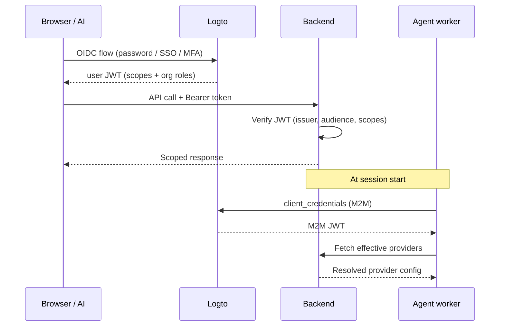
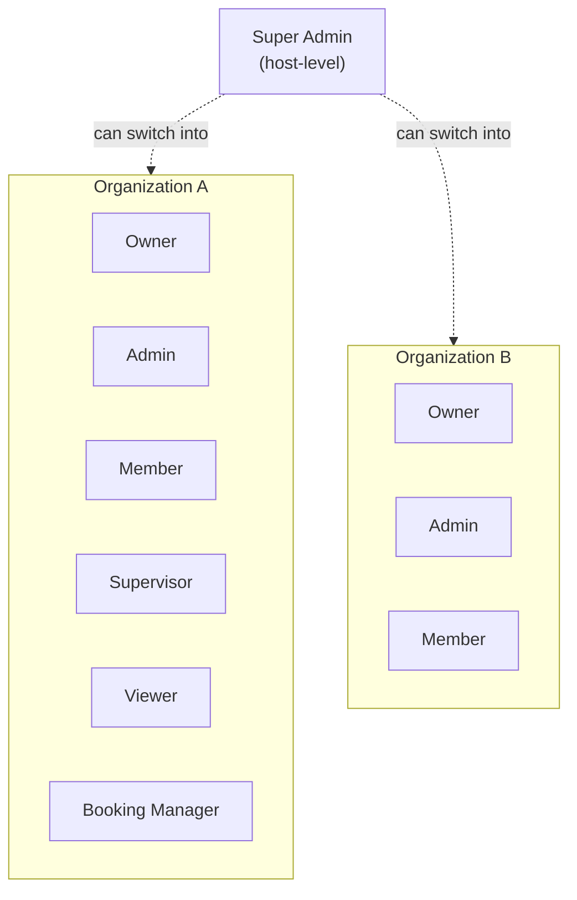
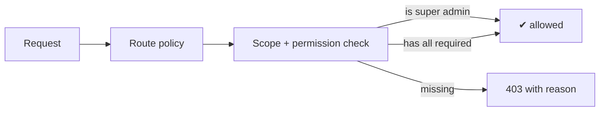

## Auth flow

Users sign in through Logto (OAuth2 / OIDC). The agent worker uses
machine-to-machine `client_credentials` for backend calls. Every
request carries a JWT the backend verifies on ingress.

## Role model

### Organization roles

| Role | API scopes | Org permissions |
|---|---|---|
| **Owner** | `*` | `*` |
| **Admin** | flows, telephony, org, monitoring, bookings | invite / remove members, manage roles, manage settings |
| **Member** | flows, telephony (read), org (read) | none |
| **Supervisor** | flows, monitoring, telephony control, org | none |
| **Viewer** | read-only across flows, telephony, monitoring, org | none |
| **Booking Manager** | bookings (all), org | none |

### Host role

| Role | Capabilities |
|---|---|
| **Super Admin** | Bypasses scope checks; can switch into any organization; the only path to operator-level runtime infrastructure controls (model selection, voice store management, GPU allocation). |

Super Admin is **host-level** — held by the deployment operator, not
by tenant users. Tenant administrators are **Owners**, not super
admins.

## Scope enforcement

- **Route policies** are mandatory — every route declares the scopes
  + organization permissions it requires. Missing policies are caught
  at startup, not in production.
- **Wildcard matching** — `flows:*` grants every `flows:*` scope.
- **Super admin bypass** — all scope checks short-circuit for the
  host role.

## Tenant isolation

Every multi-tenant entity is scoped by an `organizationId` column,
enforced on every read and write at the repository layer. The tenant
context is derived from the JWT and the active organization at
request ingress; cross-tenant access requires the host-level Super
Admin claim.

## Fail-fast secret validation

At flow trigger, every effective provider is validated against its
required secrets. Missing keys raise HTTP 412 before the agent worker
is dispatched — preventing opaque vendor 401s mid-call.

## Audit + retention

- **Call history** — every session's metadata, variable state, tool
  calls, and final status is persisted and queryable through the
  monitoring API.
- **Session recordings** — LiveKit Egress, opt-in per flow. Default
  output is audio-only on the cluster's recording volume.
- **Flow versioning** — every save creates a new version row;
  versions are inspectable and restorable.

## Compliance posture

AICO covers the working surface of authentication, authorization, and
tenant isolation listed above. For specific certifications (SOC 2,
ISO 27001, HIPAA BAA), compliance add-ons (CMK, DLP, audit-log
immutability, multi-region replication, regional data residency), or
deployment-specific risk reviews, contact
[support@aicoflow.com](mailto:support@aicoflow.com) — detailed
compliance documentation is available under NDA.
