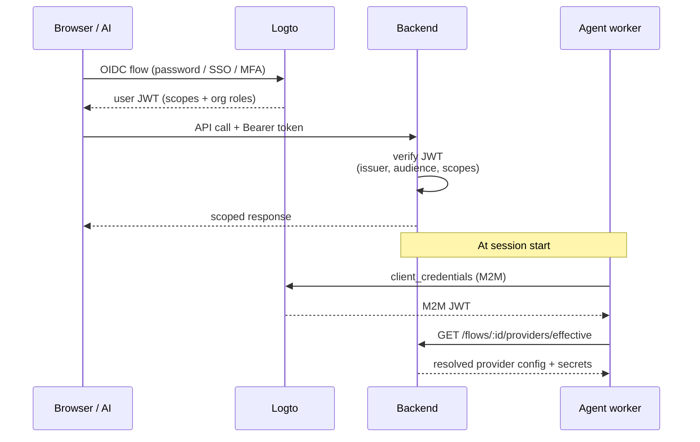
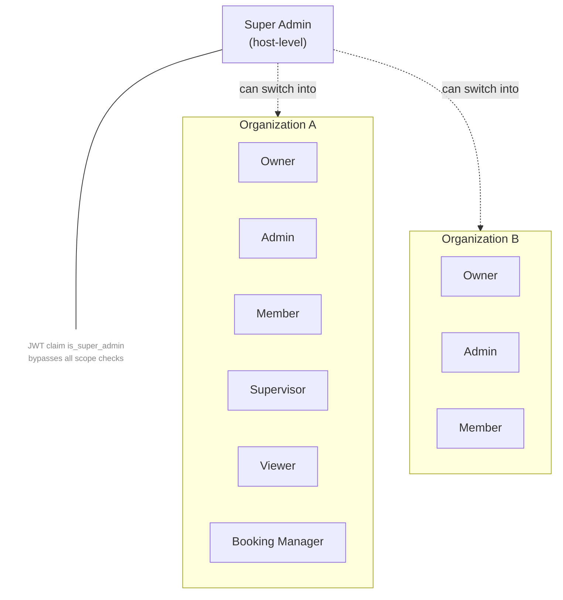
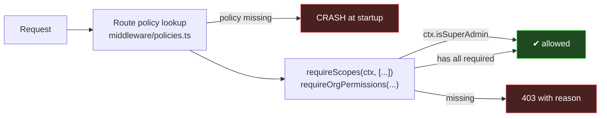
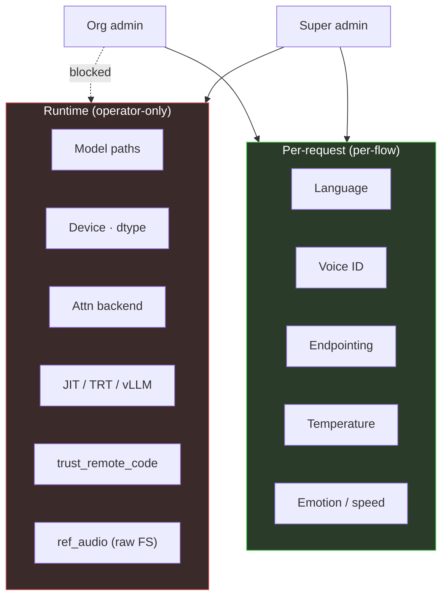

## Auth flow

Users sign in through Logto (OAuth2 / OIDC). The agent worker uses M2M
`client_credentials` for backend calls. Every request carries a JWT the
backend verifies on ingress.

## Role model

### Organization roles (from `scripts/logto/organization-roles.json`)

| Role | API scopes | Org permissions |
|---|---|---|
| **Owner** | `*` | `*` |
| **Admin** | flows, telephony, org, monitoring, bookings | invite / remove members, manage roles, manage settings |
| **Member** | flows, telephony (read), org (read) | none |
| **Supervisor** | flows, monitoring, telephony control, org | none |
| **Viewer** | read-only across flows, telephony, monitoring, org | none |
| **Booking Manager** | bookings (all), org | none |

### Host role

| Role | Claim | Capabilities |
|---|---|---|
| **Super Admin** | JWT claim `is_super_admin` (or `super_admin` / `all:organizations` scope) | Bypasses all scope checks (`backend/src/utils/authorization.ts:43`); switch into any org; only path to runtime infrastructure controls |

Super Admin is **host-level**. Tenant admins are **Owners**, not super
admins.

## Scope enforcement

- **Route policies** live in `backend/src/routes/middleware/policies.ts`.
  Every route must have a policy entry — startup crashes otherwise.
- **Scope constants** — single source of truth in
  `backend/entity-schema/src/scopes.ts` (`S.FLOWS_READ`, `S.ORG_WRITE`,
  `S.SUPER_ADMIN`, etc.).
- **Wildcard matching** — `flows:*` grants every `flows:*` scope.
- **Super admin bypass** — all scope checks short-circuit when
  `ctx.isSuperAdmin`.

## Tenant isolation

<Warning>
	Application-level filtering only. PostgreSQL row-level security
	(RLS) **is not used today**. Only the backend connects to the
	database; if shared DB access across tenants is ever needed
	(direct SQL, external tools), RLS must be added.
</Warning>

Every entity carries an `organizationId` column; repository helpers
enforce it on every query. The `TenantContext` is derived from the JWT
and the active organization at request ingress.

## Two-tier configuration

Runtime fields are defined in `runtime_schema()` on each STT / TTS
engine. They are never exposed in the per-flow UI or API. An org admin
cannot set a model path or change `trust_remote_code`, regardless of
role.

## Fail-fast secret validation

At flow trigger, every effective provider is validated against its
`secretsSchema.required`. Missing keys raise HTTP 412 before the agent
worker is dispatched — prevents opaque SDK-side 401s mid-call.

## Secrets

| Aspect | Implementation |
|---|---|
| Storage | `organization_secrets.secrets` (JSONB) |
| **At-rest encryption** | **Not applied at the app layer.** Configure at PostgreSQL / disk-volume level if required. |
| In transit | TLS to providers; M2M HTTPS to the agent worker |
| Frontend exposure | Redacted in every response |
| Rotation | `PUT /api/providers/:key/secrets` writes a new value; M2M client keys via `POST /api/api-keys/:id/rotate` |

## Audit

- **Call history** — `execution_sessions` + `call_history` — every
  session's metadata, variable state, tool calls, final status.
  Queryable via `/api/monitoring/calls/history`.
- **Session recordings** — LiveKit Egress, opt-in per flow. Default
  output: Opus OGG audio-only on the `aico-recordings` volume. S3 config
  exists in code (`ARCHIVAL_STORAGE_TYPE`, `ARCHIVAL_PATH`) but the S3
  storage backend is **not implemented**.
- **Flow versioning** — versions stored in `flow_versions` (app-level).
  No Git integration.

## Channel status

| Channel | Status |
|---|---|
| Phone (SIP via LiveKit SIP + Telnyx) | implemented |
| WhatsApp (Meta Cloud API) | implemented |
| Web widget | not implemented |
| Twilio / Vonage | schema present, no runtime adapter |

## Integrations status

Nango client (`backend/src/services/nango/nangoService.ts`) is wired to
the shared ops Nango instance. **No default providers are pre-wired** —
each organization enables integrations as needed; AICO discovers them
via the Nango action registry
(`GET /api/integrations/actions`).

## What is NOT provided

<Warning>
	To avoid compliance theater, here is what AICO does **not** have today:

	- No SOC 2 / ISO 27001 / HIPAA BAA certification
	- No right-to-erasure tooling beyond per-user delete through the
	  existing member-management routes
	- No customer-managed keys (CMK) for at-rest encryption
	- No DLP / PII redaction pre-processor
	- No multi-region replication
	- No audit-log immutability (append-only storage)

	If a deployment needs any of the above, it must be added on top —
	at the infrastructure layer (encrypted volumes, KMS) or as
	additional backend features.
</Warning>
