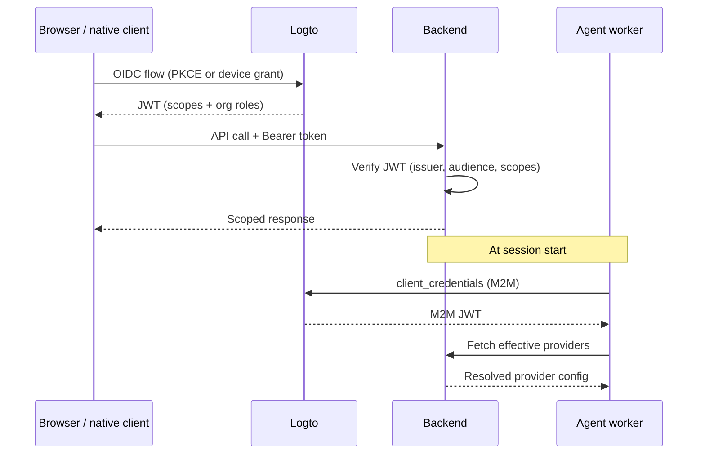
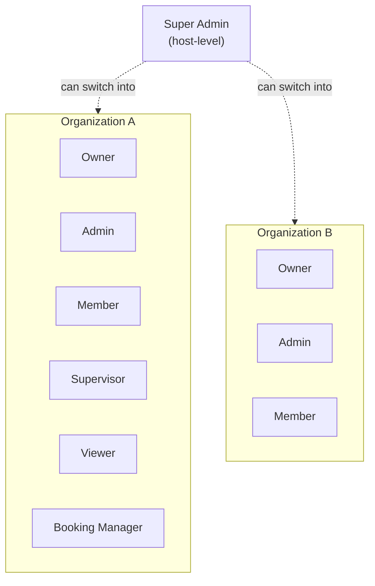
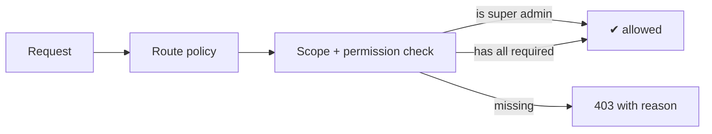

## Identity and authentication

All human and machine identities are issued by Logto (OAuth2 / OIDC).
Every API request carries a token the backend verifies on ingress.

| Caller | Mechanism |
|---|---|
| Dashboard user | OIDC authorization code + PKCE in the browser; organization-scoped JWT for org APIs |
| Native clients (watch, wearable, desktop) | OAuth 2.0 Device Authorization Grant, then organization-scoped tokens |
| Agent worker | Machine-to-machine `client_credentials` with a fixed minimal scope set |
| Server-to-server | AICO API keys (see below) |
| Organization invitations | Single-use invitation tokens embedded in magic links |
| Anonymous web visitors | No credential — a separate public tier with its own gates (see below) |

```mermaid
sequenceDiagram
    participant U as Browser / native client
    participant LG as Logto
    participant BE as Backend
    participant AGT as Agent worker

    U->>LG: OIDC flow (PKCE or device grant)
    LG-->>U: JWT (scopes + org roles)
    U->>BE: API call + Bearer token
    BE->>BE: Verify JWT (issuer, audience, scopes)
    BE-->>U: Scoped response

    Note over AGT,BE: At session start
    AGT->>LG: client_credentials (M2M)
    LG-->>AGT: M2M JWT
    AGT->>BE: Fetch effective providers
    BE-->>AGT: Resolved provider config
```

**Multi-factor authentication** — TOTP authenticator apps, WebAuthn /
passkeys, and backup codes are supported and offered at sign-in.
Whether MFA is required is a deployment policy decision.

**Password policy** — minimum length, breached-password rejection
(haveibeenpwned), and repetition / personal-info checks are enforced
at the identity provider.

**Federated login (SSO)** — sign-in is first-party by default;
enterprise SSO (SAML / OIDC) can be configured at the identity
provider per deployment. Contact us for SSO onboarding.

## API keys

For server-to-server access, AICO issues self-contained signed API
keys:

- Signed tokens carrying the organization, granted scopes, and
  optional expiry — verified without a database read.
- **Rotation** is a single call: the old key is revoked and a new one
  returned (shown once).
- **Revocation** takes effect within 30 seconds across all backend
  instances.
- An API key is always organization-scoped and can never escalate to
  operator privileges.
- Every create / update / rotate / revoke is written to the audit
  log.

## Role model

```mermaid
flowchart TB
    SA["Super Admin<br/>(host-level)"]

    subgraph OrgA["Organization A"]
        OA["Owner"]
        AA["Admin"]
        MA["Member"]
        SupA["Supervisor"]
        VA["Viewer"]
        BA["Booking Manager"]
    end

    subgraph OrgB["Organization B"]
        OB["Owner"]
        AB["Admin"]
        MB["Member"]
    end

    SA -. can switch into .-> OrgA
    SA -. can switch into .-> OrgB
```

### Organization roles

| Role | API scopes | Org permissions |
|---|---|---|
| **Owner** | all | all |
| **Admin** | flows, telephony, org, monitoring, bookings | invite / remove members, manage roles, manage settings |
| **Member** | flows, telephony (read), org (read) | none |
| **Supervisor** | flows (read), monitoring, live-call control | none |
| **Viewer** | read-only across flows, telephony, monitoring, org | none |
| **Booking Manager** | bookings only, org (read) | none |

Deliberate separations worth knowing for a review:

- **Admin is not Owner**: provider secrets, API keys, integrations,
  and billing are Owner-only.
- **Supervisor** can monitor and control live calls but cannot modify
  flows.
- **Booking Manager** is siloed to booking data — no flow or
  telephony access.

### Host role

| Role | Capabilities |
|---|---|
| **Super Admin** | Bypasses scope checks; can switch into any organization; the only path to operator-level runtime infrastructure controls (model lifecycle, voice store management, GPU allocation). |

Super Admin is **host-level** — held by the deployment operator, not
by tenant users. Tenant administrators are **Owners**, not super
admins.

## Scope enforcement

```mermaid
flowchart LR
    R["Request"] --> P["Route policy"]
    P --> S["Scope + permission check"]
    S -- "is super admin" --> A["✔ allowed"]
    S -- "has all required" --> A
    S -- "missing" --> D["403 with reason"]
```

- **Route policies are mandatory** — every route declares the scopes
  and organization permissions it requires. A route without a policy
  is caught at startup, not in production.
- **Wildcard matching** — `flows:*` grants every `flows:` scope.
- **Super admin bypass** — scope checks short-circuit for the host
  role only.

## Tenant isolation

Every multi-tenant entity is scoped by an organization ID, enforced
on every read and write at the application layer; the tenant context
is derived from the verified token and the active organization at
request ingress. Organization-scoped tokens are the only tokens
accepted on organization APIs. As defense in depth, row-level
security policies are provisioned on tenant tables at the database
layer; the application layer is the primary enforcement boundary.
Cross-tenant access requires the host-level Super Admin role.

## Anonymous web tier

The public widget endpoints are a separate, deliberately narrow
surface:

- Disabled by default — each flow must explicitly enable web access.
- Requests are validated against the flow's **origin allowlist**.
- **Rate limits** apply per visitor session and per IP.
- No organization data is reachable: the anonymous tier can only
  converse with the enabled flow.
- Optional **signed identity**: your backend vouches for a visitor
  with an HMAC-signed token; AICO verifies it against a
  per-organization secret.

## Audit and retention

- **Audit log** — administrative actions (organization settings,
  provider secrets, API keys, datasets, notifications) are recorded
  as structured audit events, queryable per organization with actor,
  action, resource, and time filters.
- **Call history** — every session's metadata, variable state, tool
  calls, and final status is persisted and queryable through the
  monitoring API.
- **Session recordings** — opt-in per flow (off by default), decided
  flow-over-organization-over-instance. Audio-only output to the
  instance's recording volume or S3-compatible object storage.
  Playback URLs are short-lived and signed.
- **Flow versioning** — every save appends an immutable version
  snapshot; rollbacks create new versions rather than rewriting
  history.
- **Transcripts and memory** — persisted in the primary database;
  retention windows are deployment policy.

## Fail-fast secret validation

At flow trigger, every effective provider is validated against its
required secrets. Missing keys raise HTTP 412 before the agent worker
is dispatched — preventing opaque vendor 401s mid-call.

## Compliance posture

AICO covers the working surface of authentication, authorization,
tenant isolation, and auditability described above. For specific
certifications (SOC 2, ISO 27001, HIPAA BAA), compliance add-ons
(CMK, DLP, audit-log immutability, multi-region replication, regional
data residency), or deployment-specific risk reviews, contact
[support@aicoflow.com](mailto:support@aicoflow.com) — detailed
compliance documentation is available under NDA.
