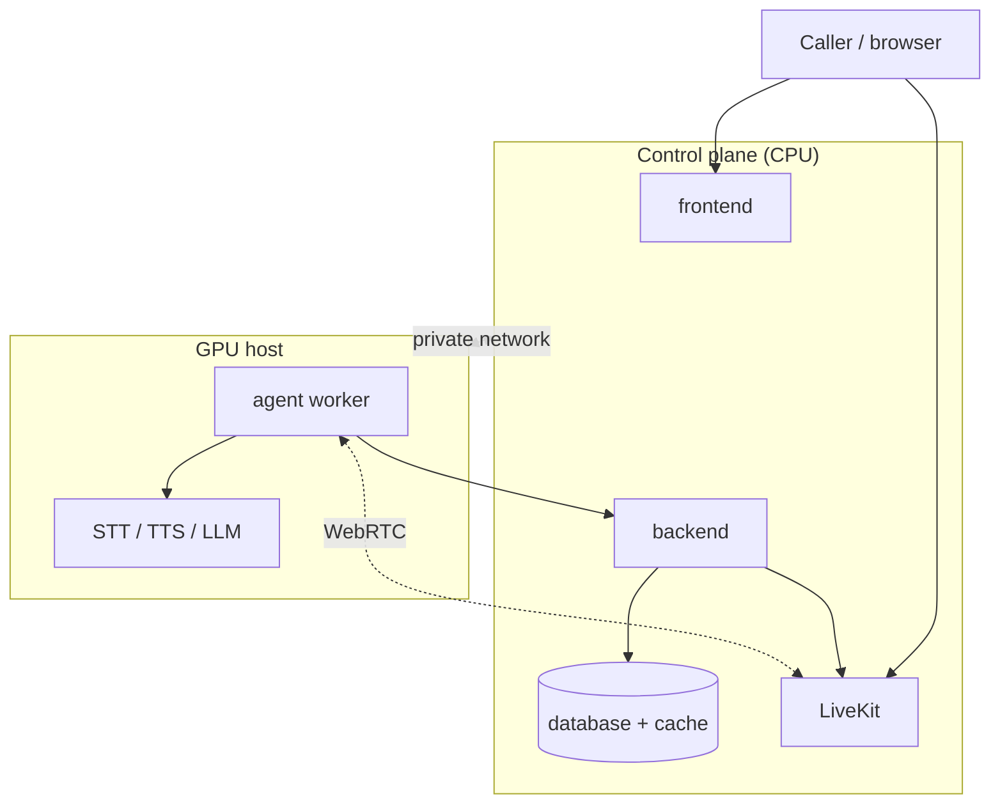

Target: **10 concurrent voice sessions, 8K LLM context window**. STT
and TTS model weights are shared across sessions; **LLM KV cache is
per-session and dominates VRAM**.

## LLM VRAM (Q4_K_M quantization)

| Model | Weights | KV @ 8K × 10 | Total VRAM |
|---|---|---|---|
| Gemma 3 4B | 2.5 GB | 8 GB | **~11 GB** |
| Gemma 3 12B | 7 GB | 20 GB | **~29 GB** |
| Gemma 3 27B | 16 GB | 30 GB | **~48 GB** |
| Llama 3.1 8B | 5 GB | 15 GB | **~22 GB** |
| Llama 3.3 70B | 40 GB | 40 GB | **~84 GB** |
| Llama-4 Scout 109B MoE | 55 GB | 60 GB | **~118 GB** |

## STT VRAM (shared weights + per-session)

| Model | Weights | + 10 sessions | Total |
|---|---|---|---|
| Qwen3-ASR 1.7B | 3.4 GB | 2 GB | ~5.5 GB |
| Cohere Transcribe 2B | 4 GB | 2.5 GB | ~6.5 GB |
| faster-whisper large v3 (int8) | 1.5 GB | 1.5 GB | ~3 GB |
| Vosk | 0.2 GB | ~1 GB RAM | CPU-only |

## TTS VRAM (shared weights + per-session)

| Model | Weights | + 10 sessions | Total |
|---|---|---|---|
| VoxCPM2 | 2 GB | 3 GB | ~5 GB |
| Qwen3-TTS 1.7B | 3.4 GB | 4 GB | ~7.5 GB |
| CosyVoice2 | 1 GB | 2 GB | ~3 GB |
| F5-TTS | 1.5 GB | 3 GB | ~4.5 GB |
| Orpheus | 2 GB | 2.5 GB | ~4.5 GB |
| Kokoro / Piper | ≤ 0.3 GB | CPU-friendly | — |

## GPU tier matrix

| Tier | LLM | Minimum GPU | Stable GPU |
|---|---|---|---|
| Entry | Gemma 3 4B | RTX 4090 24 GB | RTX 6000 Ada 48 GB |
| Balanced | Gemma 3 12B | RTX 6000 Ada 48 GB | L40S 48 GB |
| Recommended | Gemma 3 27B / Llama 3 8B | H100 80 GB | MI300X 192 GB |
| Pro | Llama 3.3 70B | MI300X 192 GB | H200 141 GB |
| Flagship | Llama-4 Scout 109B | H200 141 GB | MI300X 192 GB |

**Minimum**: fits the stated workload at 4K context, no headroom.
**Stable**: 8K context with ~30 % VRAM headroom for fragmentation +
burst concurrency.

## Host sizing per GPU node

| Resource | Minimum | Stable |
|---|---|---|
| System RAM | 2× GPU VRAM | 3× GPU VRAM |
| NVMe | 100 GB | 500 GB |
| CPU | 8 cores | 16 cores |
| PCIe | Gen4 x8 | Gen4/5 x16 |
| Network | 1 Gbps | 10 Gbps |

## Sizing rules

<Info>
    Concurrency is KV-cache bound. Halving context length halves
    per-session memory cost.
</Info>

<Info>
    LLM throughput is memory-bandwidth bound, not FLOPs — HBM3/HBM3e
    matters more than core count.
</Info>

<Info>
    vLLM's paged KV cache + continuous batching ≈ 3× the concurrency of
    vanilla Ollama on the same hardware. Prefer it for production
    deployments.
</Info>

## Topology options

### Single host

Everything in one Kubernetes cluster (single-host or multi-node).
Simplest deployment. Suitable for sub-10-concurrent voice loads on a
single GPU box, plus a smaller CPU-only sidecar for the data tier if
desired.

### Split (control plane + GPU)

Control-plane services (frontend, backend, database, LiveKit, cache)
on CPU hosts; the GPU-bound services (STT, TTS, LLM, agent worker) on
one or more GPU hosts. Connect the two over a private network — VPN,
WireGuard, Tailscale, or a private VPC peering link.

For larger fleets, the split scales to many GPU hosts and a single
control-plane cluster.
