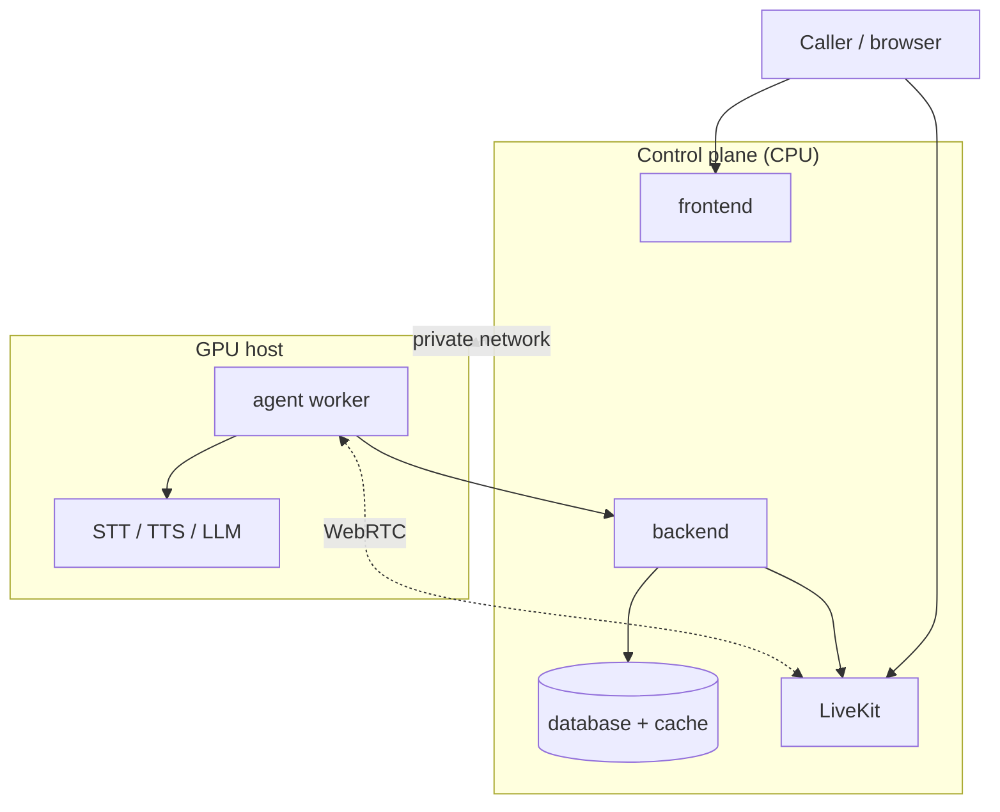

Target: **10 concurrent voice sessions, 8K LLM context window**. STT
and TTS model weights are shared across sessions; **LLM KV cache is
per-session and dominates VRAM**.

All VRAM figures are indicative and depend on quantization and
serving configuration.

## LLM VRAM (self-hosted catalog)

| Model | Total VRAM (weights + KV @ 8K × 10) |
|---|---|
| Gemma 3 4B (Q4) | **~11 GB** |
| Gemma 3 12B (Q4) | **~29 GB** |
| Gemma 3 27B (Q4) | **~48 GB** |
| Qwen3 8B (Q4) | **~22 GB** |
| GPT-OSS-20B | **~16 GB** |
| Ling-2.6-flash INT4 | **~24 GB** |
| Qwen3 30B-A3B MoE (Q4) | **~35 GB** |
| Ling-2.6-flash FP8 | **~80 GB** |
| Llama-4 Scout 109B MoE (Q4) | **~118 GB** |
| Ling-2.6-flash (full) | **~200 GB** |

## STT VRAM (shared weights + per-session)

| Model | Weights | + 10 sessions | Total |
|---|---|---|---|
| Qwen3-ASR 1.7B | 3.4 GB | 2 GB | ~5.5 GB |
| Cohere Transcribe 2B | 4 GB | 2.5 GB | ~6.5 GB |
| faster-whisper large v3 (int8) | 1.5 GB | 1.5 GB | ~3 GB |
| faster-whisper distil-large-v3 / tiny | ≤ 1 GB | ~1 GB | ≤ 2 GB |
| Vosk | 0.2 GB | ~1 GB RAM | CPU-only |

The emotion2vec paralinguistic sidecar (emotion + sentiment) is
lightweight and runs alongside a transcribing engine on CPU or GPU.

## TTS VRAM (shared weights + per-session)

| Model | Weights | + 10 sessions | Total |
|---|---|---|---|
| VoxCPM 2B | 2 GB | 3 GB | ~5 GB |
| Qwen3-TTS 1.7B | 3.4 GB | 4 GB | ~7.5 GB |
| CosyVoice2 | 1 GB | 2 GB | ~3 GB |
| F5-TTS | 1.5 GB | 3 GB | ~4.5 GB |
| Orpheus 3B | 2 GB | 2.5 GB | ~4.5 GB |
| Kokoro / Piper | ≤ 0.3 GB | CPU-friendly | — |

## GPU tier matrix

| Tier | LLM | Minimum GPU | Stable GPU |
|---|---|---|---|
| Entry | Gemma 3 4B | RTX 4090 24 GB | RTX 6000 Ada 48 GB |
| Balanced | Gemma 3 12B / Ling INT4 | RTX 6000 Ada 48 GB | L40S 48 GB |
| Recommended | Gemma 3 27B / Qwen3 30B-A3B | H100 80 GB | MI300X 192 GB |
| Pro | Ling-2.6-flash FP8 | H100 80 GB | H200 141 GB |
| Flagship | Llama-4 Scout / Ling-2.6-flash | H200 141 GB | MI300X 192 GB |

**Minimum**: fits the stated workload at 4K context, no headroom.
**Stable**: 8K context with ~30 % VRAM headroom for fragmentation +
burst concurrency.

Self-hosted inference images are built per accelerator — **CPU, CUDA,
and ROCm** variants — so the same catalog runs on NVIDIA and AMD
hardware, with CPU fallbacks for the lightweight engines.

## Host sizing per GPU node

| Resource | Minimum | Stable |
|---|---|---|
| System RAM | 2× GPU VRAM | 3× GPU VRAM |
| NVMe | 100 GB | 500 GB |
| CPU | 8 cores | 16 cores |
| PCIe | Gen4 x8 | Gen4/5 x16 |
| Network | 1 Gbps | 10 Gbps |

## Sizing rules

<Info>
    Concurrency is KV-cache bound. Halving context length halves
    per-session memory cost.
</Info>

<Info>
    LLM throughput is memory-bandwidth bound, not FLOPs — HBM3/HBM3e
    matters more than core count.
</Info>

<Info>
    The self-hosted LLM plane runs vLLM: paged KV cache + continuous
    batching gives roughly 3× the concurrency of a vanilla Ollama
    setup on the same hardware.
</Info>

## Topology options

### Single host (dedicated instance)

The full platform on one Linux host as a self-contained container
bundle — the standard shape for dedicated and on-prem instances.
Suitable for sub-10-concurrent voice loads on a single GPU box (or
CPU-only when using cloud inference providers). Ships with a guided
update script and restore runbook.

### Kubernetes cluster

The same services deployed from the platform's Kubernetes charts, for
customers operating their own clusters or larger multi-node
footprints.

### Split (control plane + GPU)

Control-plane services (frontend, backend, database, media, cache) on
CPU hosts; the GPU-bound services (STT, TTS, LLM, agent worker) on
one or more GPU hosts. Connect the two over a private network — VPN,
WireGuard, Tailscale, or private VPC peering.

```mermaid
flowchart TB
    subgraph CP["Control plane (CPU)"]
        FE["frontend"]
        BE["backend"]
        DB[("database + cache")]
        LK["LiveKit"]
    end
    subgraph GPU["GPU host"]
        AGT["agent worker"]
        ST["STT / TTS / LLM"]
    end
    User["Caller / browser"] --> FE
    User --> LK
    BE --> DB
    BE --> LK
    AGT --> BE
    LK <-. WebRTC .-> AGT
    AGT --> ST
    CP <-. private network .-> GPU
```

For larger fleets, the split scales to many GPU hosts and a single
control plane.
